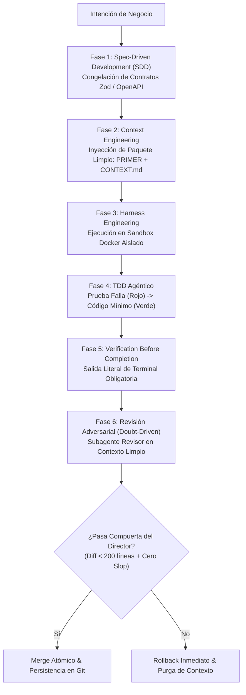

# IVC-OS: Guía de Campo para Directores de Plataformas de Vibe Coding
> **Estándar Maestro de Dirección Estratégica, Rigor de Ingeniería y Gobernanza de Flotas de Agentes**  
> *Versión 1.0 — Septiembre 2026 — Ecosistema IVC-OS / VibeCoder*

---

## 0. Manifiesto y Rol Rector del Director de Vibe Coding

El **Vibe Coding** representa una de las mayores transmutaciones en la historia de la computación: el lenguaje natural se convierte en la sintaxis de invocación y compilación de sistemas digitales. Sin embargo, sin dirección formal, el vibe coding degenera invariablemente en deuda técnica exponencial, alucinaciones silenciosas, componentes rotos, fugas de secretos y el vicio operativo conocido como **Prompt-and-Pray** (promptear a ciegas y rezar para que funcione).

En el marco de **IVC-OS (Intelligent Vibe Coding Operating System)**, el ser humano al mando de la plataforma no es un espectador pasivo ni un simple escritor de prompts casuales. El ser humano es el **Director de Orquesta, Arquitecto en Jefe y Auditor Fiduciario**:

1. **El Director no compite con el agente en velocidad de escritura; compite en claridad de intención, rigor de frontera y juicio de valor.**
2. **Ninguna línea de código de implementación se autoriza sin una especificación congelada previa.**
3. **El agente que programa jamás aprueba su propio código (*Regla de No Self-Approval*).**
4. **La evidencia de terminal y las aserciones deterministas prevalecen siempre sobre cualquier afirmación en lenguaje natural (*Verification Before Completion*).**
5. **Cero tolerancia al software de utilería, datos falsificados o promesas que el sistema no puede respaldar con código.**

---

## 1. Eje I: Dirección Estratégica & Gobernanza de Intención (Nivel CPO / Founder / Director)

### Protocolo 1.1: Ingeniería de Intención y Delimitación de Alcance (*Intent Framing*)
* **Contexto / Trigger:** Inicio de cualquier proyecto, épica o módulo funcional dentro de la plataforma.
* **Insumos Obligatorios (Inputs):** Problema real de negocio, usuario beneficiario primario, métrica de éxito cuantificable y lista explícita de exclusiones.
* **Procedimiento del Director:**
  1. **Formular la Frontera Negativa:** Antes de describir qué hace la funcionalidad, el Director define qué **NO** hace. Esto evita que los agentes hiper-generen subsistemas innecesarios.
  2. **El Test de Descomposición:** Si la intención del usuario o founder involucra más de una frontera de datos o más de dos subsistemas independientes, el Director la descompone en sub-proyectos atómicos antes de interactuar con el primer agente.
  3. **Inyección de Restricciones Operativas:** Se fijan de antemano el stack permitido, las dependencias autorizadas y el entorno de destino.
* **Hard Gate (Go / No-Go):**
  * ❌ *NO-GO:* Si el requerimiento dice "haz una app como Uber pero para pasear perros con chat, pagos y mapas en tiempo real", se rechaza inmediatamente por falta de delimitación.
  *  *GO:* Se aprueba únicamente cuando el alcance se restringe a: *"Módulo de registro y autenticación con Next.js + PostgreSQL + RLS, excluyendo pagos y mapas en esta iteración"*.

---

### Protocolo 1.2: Tokenomics y Presupuestos de Inferencia (*Budget Guardrails*)
* **Contexto / Trigger:** Asignación de recursos de computación e inferencia para cada tarea delegada a agentes.
* **Insumos Obligatorios:** Presupuesto en dólares por tarea (\$USD), cuota máxima de tokens por ventana de contexto y tasa de llamadas a API por minuto.
* **Procedimiento del Director:**
  1. **Asignación de Techos Financieros:** Ningún agente recibe autonomía presupuestaria ilimitada. Se establece un tope duro por tarea atómica (ej. \$1.50 USD por micro-módulo; \$10.00 USD por feature compleja).
  2. **Umbral de Alerta Temprana (80% Burn Rate):** Si la flota de agentes consume el 80% del presupuesto asignado sin haber emitido un pull request con pruebas en verde, el sistema congela la ejecución.
  3. **Optimización de Modelo según Complejidad:**
     * *Modelos Ligeros / Flash:* Búsqueda, parsing, linters, scaffolding inicial y redacción de documentación.
     * *Modelos de Razonamiento Profundo / Pro / High:* Diseño de especificaciones, modelado de esquemas de datos, debugging de errores oscuros y auditoría de seguridad adversarial.
* **Hard Gate:**
  * ❌ *NO-GO:* Agente consumiendo más de 3 ciclos de razonamiento sin generar un artefacto verificable o diff ejecutable. El arnés revoca permisos de inferencia de inmediato.

---

### Protocolo 1.3: Blindaje de Propiedad Intelectual y Licenciamiento
* **Contexto / Trigger:** Inclusión o sugerencia de paquetes de terceros (npm, PyPI, Crates, Docker Hub).
* **Insumos Obligatorios:** Manifiesto de dependencias (`package.json`, `requirements.txt`) y reporte de licencias de dependencias transitivas.
* **Procedimiento del Director:**
  1. **Lista Blanca de Licencias:** Solo se autorizan dependencias bajo licencias permisivas (MIT, Apache 2.0, BSD-2/3, ISC).
  2. **Bloqueo de Licencias Víricas:** Se prohíbe terminantemente la incorporación de paquetes bajo licencias copyleft estrictas (GPL v2/v3, AGPL) a menos que el proyecto de la plataforma haya sido declarado legalmente como open-source puro bajo esa misma licencia.
  3. **Trazabilidad Criptográfica de Generación:** Cada commit emitido en la plataforma debe registrar metadatos de autoría: ID del agente, ID del modelo, hash de la especificación fuente y firma GPG/SSH del runtime de la plataforma.

---

### Protocolo 1.4: Prevención de Alucinación Sistémica y Deriva de Producto (*Anti-Feature Creep*)
* **Contexto / Trigger:** Revisión de planes generados por los agentes previo a la codificación.
* **Insumos Obligatorios:** Documento de especificación contra propuesta de cambios.
* **Procedimiento del Director:**
  1. **Inspección de Sobregiro Funcional:** Identificar si el agente ha propuesto dependencias accesorias (ej. agregar Redux cuando solo se necesitaba estado local, o montar un cluster Kafka para un MVP de 10 usuarios).
  2. **YAGNI Implacable (*You Aren't Gonna Need It*):** Podar activamente cualquier sugerencia que pretenda anticiparse a problemas que el negocio no tiene hoy.
  3. **Inmutabilidad del Contrato:** Si un agente detecta una "mejora de producto", no puede implementarla motu proprio; debe registrarla en un archivo de notas (`BACKLOG_CANDIDATES.md`) y ceñirse estrictamente a la especificación activa.

---

## 2. Eje II: Dirección Técnica & Tríada de Blindaje Operativo (Lead Architect / Manager)

Este eje es el corazón de la ingeniería de software moderna con agentes. Se basa en tres pilares indestructibles: **Spec-Driven Development (SDD)**, **Context Engineering** y **Harness Engineering**.



---

### Protocolo 2.1: Spec-Driven Development (SDD) & Congelación de Contratos
* **Principio:** *"Ningún agente escribe código de aplicación sin una especificación formal preexistente y congelada"*.
* **Procedimiento del Director:**
  1. **Generación de la Especificación:** El agente arquitecto produce un archivo de especificación que contiene:
     - Modelos de datos y esquemas de validación fuertemente tipados (Zod en TypeScript, Pydantic en Python).
     - Contrato de interfaces de API (rutas, query params, headers, status codes y schemas de respuesta JSON).
     - Comportamiento ante errores (códigos de error canónicos, estructura del mensaje de fallo).
     - Invariantes de negocio y criterios de aceptación (Gherkin / Given-When-Then).
  2. **Revisión y Congelación Humana:** El Director lee la especificación, valida que represente la intención y la sella (`APPROVED_SPEC_HASH`).
  3. **Prohibición de Código Suelto:** Los agentes constructores reciben la especificación como única fuente de verdad. Tienen prohibido modificar los contratos de tipos durante la fase de implementación. Si un agente descubre que un tipo es insuficiente, debe solicitar una pausa para modificar la especificación, no improvisar en el código.

---

### Protocolo 2.2: Context Engineering & Memoria Persistente de Proyecto
* **Principio:** *"La calidad del código generado por un modelo es directamente proporcional a la densidad y pureza de su ventana de contexto"*.
* **Patología a Evitar:** *Context Rot* (degradación cognitiva provocada por meter cientos de líneas de logs ruidosos o archivos irrelevantes en el chat).
* **Procedimiento del Director:**
  1. **Estructuración en 3 Archivos Maestros de Memoria:**
     * `PROJECT_SPEC.md`: El qué y el por qué del módulo.
     * `CONTEXT.md`: El estado actual del sistema, decisiones arquitectónicas tomadas y restricciones vigentes.
     * `SESSION_PRIMER.md`: Paquete de inicio rápido para instanciar cualquier sesión o agente nuevo sin gastar tokens de bienvenida.
  2. **Regla de Poda Activa (*Context Pruning*):**
     * Nunca inyectar trazas de stack trace completas de 500 líneas; inyectar únicamente el mensaje de error y las 10 líneas de código circundantes.
     * Al concluir cada ciclo de desarrollo, resumir las decisiones clave en `CONTEXT.md` y desechar el historial de conversación anterior.
  3. **Presupuesto de Ventana:**
     * Máximo 15% de la ventana de contexto para instrucciones del sistema y memoria del proyecto.
     * Máximo 25% para fragmentos de código relevantes y esquemas de tipos.
     * 60% libre para el espacio de razonamiento y generación de diffs.

---

### Protocolo 2.3: Harness Engineering & Sandboxing de Ejecución
* **Principio:** *"El agente nunca programa directamente en el sistema host ni en entornos compartidos; opera dentro de un arnés de confinamiento determinista"*.
* **Componentes del Arnés:**
  1. **Sandbox Docker Efímero:**
     * Cada tarea corre en un contenedor aislado con sistema de archivos temporal montado en modo Copy-on-Write.
     * Base de datos PostgreSQL con extensión `pgvector` inicializada mediante migraciones automáticas en memoria.
  2. **Egress Guardrail (Blindaje de Fuga de Red):**
     * El contenedor tiene prohibido el acceso a Internet no regulado (`--network none` o firewall con lista blanca estricta).
     * El agente no puede enviar código, credenciales o datos a servidores externos desconocidos.
  3. **Mocks Deterministas:** Las integraciones con pasarelas de pago (Stripe), correos (Resend) o APIs de terceros deben pasar por servidores mock locales en el arnés.
  4. **Intercepción y Telemetría de Comandos:** Cada comando bash/powershell ejecutado dentro del arnés queda registrado en un log inmutable con su timestamp y código de salida.

---

### Protocolo 2.4: Las 7 Reglas de Oro de Veracidad, Anti-Slop y Kickoff

Cuando un agente comienza a diseñar interfaces, landing pages o componentes visuales, el Director aplica obligatoriamente las **7 Reglas de Oro**:

#### 1. Mandato de Cero Prueba Social Falsa (*Zero-Fabricated-Proof*)
* **Prohibición Absoluta:** Jamás generar testimonios con nombres falsos (*"John Doe, CEO de Initech"*), fotos de personas de bancos de imágenes o contadores de tracción inflados (*"+10,000 clientes felices"*).
* **Solución Día 0:** Si el proyecto no tiene clientes reales, **la sección de testimonios se suprime por completo**. Se sustituye por una **Demostración de Mecanismo en Vivo (Proof of Mechanism)**: un widget interactivo, simulador o playground donde el usuario prueba la tecnología con sus propias manos.

#### 2. La Prueba del Hecho Verificable (*Verifiable Claims Only*)
* Todo número cuantitativo en el copy debe derivar de un benchmark comprobable en el repositorio.
* Prohibido: *"Ahorra 90% de tiempo en tu equipo"*.
* Permitido: *"Reduce el flujo de configuración de 7 pasos manuales a 1 comando"*.

#### 3. Disciplina de "Estado Vacío Primero" (*Empty-State First*)
* Los agentes tienden a poblar las tablas con datos falsos (gráficas con millones de pesos facturados).
* El Director exige programar primero el **Empty State**: ¿Cómo se ve la pantalla cuando el usuario tiene 0 registros? Con una ilustración sobria, una explicación clara y un botón de acción primaria visible (*"Crea tu primer proyecto"*).
* Los datos de prueba deben vivir estrictamente en un archivo `src/mocks/fixtures.ts` con una bandera de entorno (`VITE_USE_MOCKS=true`), nunca hardcodeados en el JSX de producción.

#### 4. Mandato Anti-Placeholders (*Zero-Slop Enforcement*)
* Cero comentarios tramposos: `// TODO: implement later`, `// ... rest of logic`, `// add more here`.
* Cero texto de relleno `Lorem Ipsum`.
* Todo botón debe ejecutar una función real. Si un botón dice *"Descargar Reporte"*, o descarga el documento real o no se dibuja en la pantalla. Cero utilería de cartón.

#### 5. Arquitectura "Zero Dead-Ends" (Cero Callejones sin Salida)
* Todo link en el navbar o footer debe resolver a una página real con contenido veraz.
* Los enlaces a `href="#"` están terminantemente prohibidos en las entregas del agente.

#### 6. El "Benefit Test" (Beneficio Real sobre Jerga Artificial)
* Someter cada descripción de feature a la prueba de dos preguntas: *"¿Y qué?"*.
* La IA escribe: *"Motor de procesamiento neuronal asíncrono con Web Workers"*.
* La corrección del Director: *"La pantalla nunca se congela mientras se exportan tus archivos"*.

#### 7. Checklist de Pre-Vuelo de Veracidad del Director
Antes de aprobar cualquier entrega visual, el Director valida esta lista de control:
* [ ] ¿Hay nombres o fotos de clientes inexistentes? → **RECHAZO INMEDIATO**.
* [ ] ¿Hay métricas de usuarios o facturación no respaldadas por la base de datos? → **RECHAZO INMEDIATO**.
* [ ] ¿Hay logos de corporativos usados sin convenio o autorización explícita? → **RECHAZO INMEDIATO**.
* [ ] ¿El estado con 0 registros es completamente funcional y amigable? → **APROBADO**.

---

### Protocolo 2.5: TDD Agéntico & Evidencia Obligatoria (*Verification Before Completion*)
* **Principio:** *"Una tarea no se considera resuelta hasta que el arnés entrega la salida de terminal que demuestra que las pruebas pasaron en verde"*.
* **Procedimiento del Director:**
  1. **Fase Roja (Red):** El agente escribe una prueba automatizada que describe el comportamiento esperado según la especificación. La prueba se ejecuta y **debe fallar** demostrando que el código aún no existe.
  2. **Fase Verde (Green):** El agente genera el código mínimo necesario para que la prueba pase.
  3. **Fase de Refactorización (Refactor):** Se limpia el código manteniendo las pruebas pasando.
  4. **Entrega de Evidencia de Terminal:** El agente tiene prohibido decir frases como *"el código ha sido actualizado y funciona perfectamente"*. La entrega obligatoria debe incluir el bloque de salida de consola literal:
     ```bash
     $ npm test -- --runInBand
     PASS  tests/auth/login.test.ts
       ✓ should authenticate valid credentials with secure JWT (42 ms)
       ✓ should reject expired token with 401 Unauthorized (12 ms)
     Tests: 2 passed, 2 total
     Snapshots: 0 total
     Time: 1.245 s
     Ran all test suites.
     ```

---

### Protocolo 2.6: Revisión Adversarial & Micro-Diffs (*Doubt-Driven Development*)
* **Principio:** *"Ningún agente puede ser el juez de su propia obra. La duda sistemática es la mejor herramienta de control de calidad"*.
* **Procedimiento del Director:**
  1. **La Regla de No-Self-Approval:** Cuando el agente constructor (*Implementer Agent*) concluye su trabajo, el Director invoca a un **Agente Revisor Adversarial (*Code Reviewer*)** en un contexto limpio e independiente.
  2. **Misión del Agente Revisor:** Su misión no es felicitar al constructor, sino intentar romper la solución:
     - Buscar condiciones de carrera en operaciones asíncronas.
     - Detectar inyecciones SQL, XSS o consumo desprotegido de memoria.
     - Validar que no se hayan roto contratos previos.
  3. **Límite de Micro-Diffs:**
     - El pull request no debe exceder las **150-200 líneas de código modificadas**.
     - Si un agente presenta un diff de 800 líneas repartidas en 12 archivos, el Director rechaza el lote y le ordena entregarlo en fases incrementales atómicas.

---

## 3. Eje III: Operación de Plataforma, Flotas de Agentes & Multi-Tenancy (Platform & SaaS Operator)

### Protocolo 3.1: Aislamiento Multi-Tenant Estricto (*Tenant Boundary Enforcement*)
* **Contexto:** Garantizar que los agentes que trabajan para el Cliente A jamás lean, modifiquen o alucinen con datos del Cliente B.
* **Procedimiento del Director:**
  1. **Aislamiento en Base de Datos:** Toda tabla multi-inquilino debe incorporar la columna `tenant_id UUID NOT NULL` con políticas activas de **Row-Level Security (RLS)** en PostgreSQL:
     ```sql
     ALTER TABLE projects ENABLE ROW LEVEL SECURITY;
     CREATE POLICY tenant_isolation_policy ON projects
       FOR ALL USING (tenant_id = current_setting('app.current_tenant_id')::uuid);
     ```
  2. **Aislamiento Vectorial (Embeddings):** Las colecciones de RAG en `pgvector` deben particionarse obligatoriamente por `tenant_id`. Ningún query vectorial puede ejecutarse sin el filtro WHERE de tenant explícito.
  3. **Aislamiento de Almacenamiento de Objetos:** Los buckets S3 deben usar prefijos estructurados: `s3://ivc-storage/{tenant_id}/{project_id}/artifacts/`.

---

### Protocolo 3.2: Gestión de Flotas de Agentes Efímeros (*Disposable Fleet Pattern*)
* **Principio:** *"Los agentes son trabajadores desechables de un solo uso; los contratos y los repositorios son eternos"*.
* **Ciclo de Vida Formal del Agente:**
  1. `SPAWNED`: Se crea una instancia limpia del agente con rol especializado.
  2. `CONTEXT_LOADED`: Se inyecta la especificación atómica y el `SESSION_PRIMER.md`.
  3. `EXECUTING_IN_HARNESS`: Trabaja confinado dentro del contenedor Docker.
  4. `ADVERSARIAL_AUDIT`: Es evaluado por el agente de revisión y el arnés de pruebas.
  5. `COMMITTED`: Se extrae el diff atómico verificado.
  6. `TERMINATED`: La instancia del agente se destruye completamente. Su memoria volátil se desecha para evitar contaminación cruzada con la siguiente tarea.

---

### Protocolo 3.3: Tool Gateway & Matriz de Permisos por Nivel de Riesgo
Toda llamada a herramientas (*Tool Calling*) debe pasar por un gateway central que valida políticas de seguridad antes de permitir la ejecución física:

| Nivel de Riesgo | Tipo de Herramienta | Ejemplos | Modo de Ejecución |
|---|---|---|---|
| **Nivel 0 (Inocuo)** | Lectura local | `view_file`, `list_dir`, `grep_search` | **Autónomo** (Sin confirmación humana) |
| **Nivel 1 (Bajo)** | Escritura en sandbox | `replace_file_content`, `write_to_file` en carpetas locales temporales | **Autónomo dentro de límites del proyecto** |
| **Nivel 2 (Medio)** | Red y dependencias | `npm install`, consultas HTTP a dominios en lista blanca | **Notificación en log + Verificación de hash** |
| **Nivel 3 (Crítico / Alto)** | Destructivo / Producción | Despliegue en cloud (`vercel deploy`), migraciones de base de datos en producción, transacciones monetarias, borrado de ramas | **HARD GATE: Requiere aprobación explícita humana (2FA / Botón manual)** |

---

### Protocolo 3.4: Observabilidad Distribuida con OpenTelemetry
* Toda solicitud en la plataforma inicia con un `TraceId` único que se propaga a lo largo de todo el pipeline:
  $$\text{TraceId} \longrightarrow \text{Prompt Usuario} \longrightarrow \text{Agente Orquestador} \longrightarrow \text{Subagentes} \longrightarrow \text{Tool Calls} \longrightarrow \text{Commits}$$
* Métricas clave a monitorear en el dashboard del Director:
  * **Token Efficiency Ratio:** Relación entre tokens consumidos y líneas de código probadas y aprobadas.
  * **First-Time Pass Rate (FTPR):** Porcentaje de tareas en que el código del agente pasa el arnés de pruebas en el primer intento.
  * **Drift Index:** Frecuencia con la que un agente intenta tocar archivos ajenos a su especificación asignada.

---

## 4. Catálogo de Anti-Patrones Letales del Director de Vibe Coding

| Anti-Patrón | Descripción y Síntomas | Consecuencia Catastrófica | Antídoto del Director |
|---|---|---|---|
| **1. Prompt-and-Pray** | Lanzar prompts vagos y aceptar código sin inspeccionar diffs ni correr pruebas. | Código espagueti, bugs indetectables que estallan en producción y pérdida total de control del software. | **Spec-Driven Development (SDD)** + Verificación obligatoria de terminal. |
| **2. The Self-Approval Trap** | Preguntarle al mismo agente: *"¿quedó bien?"* y conformarse con su respuesta optimista. | Falsa sensación de seguridad; los LLMs tienen sesgo de confirmación hacia sus propios errores. | **Doubt-Driven Development**: siempre auditar con un agente revisor adversarial en contexto limpio. |
| **3. Context Blindness** | Pegar logs gigantescos de 50,000 tokens en la misma conversación en un intento desesperado de depurar. | Alucinaciones severas, olvido de instrucciones previas y saturación costosa de la ventana de contexto. | **Poda de contexto (Pruning)**: aislar únicamente el error atómico y abrir una sesión limpia con `PRIMER.md`. |
| **4. Synthetic Traction Hallucination** | Dejar que el agente pueble la landing page con testimonios ficticios, clientes inventados y logos de empresas ajenas. | Destrucción de la reputación de la empresa, riesgo de litigio por publicidad engañosa y rechazo de usuarios reales. | **Mandato de Cero Prueba Social Falsa**: Suprimir testimonios o usar demos interactivas reales. |
| **5. The Monolithic Mega-Diff** | Permitir que el agente modifique 15 archivos y 1,000 líneas de código en una sola iteración. | Imposibilidad física de auditar el código; se cuelan bugs lógicos y regresiones silenciosas. | **Micro-Diff Enforcement**: Rechazo automático a cualquier entrega superior a 150-200 líneas. |
| **6. Infinite Debug Loop** | Dejar al agente intentar solucionar el mismo fallo en bucle más de 3 veces consecutivas. | Quema masiva de tokens (\$50 USD tirados a la basura en 15 minutos) sin solucionar la causa raíz. | **Circuit Breakers**: Congelación forzada al 3er intento fallido y escalamiento al Director. |

---

## 5. Runbook de Emergencia ante Deriva (*Drift Response Playbook*)

Cuando un agente de IA pierde el rumbo, el Director no debe intentar "razonar" interminablemente en el chat. Debe ejecutar los protocolos de contención mecánica inmediata:

### Emergencia A: Deriva Arquitectónica (*Architectural Drift*)
* **Síntoma:** El agente empieza a modificar archivos del core que no estaban en la especificación o añade dependencias no autorizadas en `package.json`.
* **Procedimiento Inmediato:**
  1. **Abortar la Ejecución:** Detener el proceso del agente de forma inmediata en el arnés.
  2. **Rollback en Frío:**
     ```bash
     git reset --hard HEAD
     git clean -fd
     ```
  3. **Purga Total de Memoria:** Destruir la instancia del agente y su historial conversacional.
  4. **Re-anclaje:** Volver a instanciar el agente inyectando únicamente la especificación inmutable y el archivo de restricciones negativas (lo que **NO** debe tocar).

---

### Emergencia B: Alerta de Fuga en Sandbox (*Egress Violation*)
* **Síntoma:** El gateway de red detecta un intento de conexión saliente a una dirección IP o dominio que no figura en la lista blanca de la plataforma.
* **Procedimiento Inmediato:**
  1. **Aislamiento de Red Inmediato:** Congelar el contenedor Docker (`docker pause`).
  2. **Revocación de Secretos:** Rotar inmediatamente cualquier API key, token de sesión o variable de entorno inyectada en el arnés.
  3. **Auditoría Forense de Código:** Escaneo estático con Semgrep para detectar código ofuscado o llamadas a librerías comprometidas por ataques de tipo *dependency confusion* o *typosquatting*.

---

### Emergencia C: Bucle de Depuración Ciego (*Infinite Debugger*)
* **Síntoma:** El agente intenta corregir una prueba fallida haciendo pequeñas modificaciones cosméticas que provocan el mismo fallo una y otra vez.
* **Procedimiento Inmediato:**
  1. **Corte por Disyuntor (Regla de 3 Intentos):** El sistema aborta la tarea automáticamente al tercer fallo consecutivo.
  2. **Invocación del Agente de Diagnóstico de Causa Raíz (*Root Cause Analyzer*):** Se pasa el error y el código a una sesión independiente bajo el protocolo de `vibecoder-skills/error-diagnosis`.
  3. **Arbitraje del Director:** El Director revisa el diagnóstico de causa raíz: si el error se debe a una contradicción en la especificación, el Director corrige la especificación antes de permitir que se vuelva a escribir una sola línea de código.

---

## 6. Matriz Maestra de Compuertas de Decisión (Hard Gates Go / No-Go)

Para que el Director de Plataforma autorice la promoción de cualquier desarrollo, se debe cumplir de forma binaria (100% aprobado) la siguiente matriz de compuertas:

```
========================================================================================
COMPUERTA                    CRITERIO DE RECHAZO (NO-GO)          CRITERIO DE APROBACIÓN (GO)
========================================================================================
Gate 1: Especificación       Código iniciado sin spec firmada      Spec en markdown con tipos Zod
(Spec Freeze Gate)           o tipos ambiguos (any / unknown).     congelados y casos Given-When-Then.
----------------------------------------------------------------------------------------
Gate 2: Veracidad Visual     Testimonios de stock, usuarios        Cero prueba social falsa. Empty
(Veracity & Anti-Slop Gate)  ficticios, botones muertos (href=#).  state programado. Enlaces reales.
----------------------------------------------------------------------------------------
Gate 3: Arnés y Pruebas      Sin pruebas automatizadas o reporte   Suite de pruebas pasando en verde
(TDD Verification Gate)      verbal del agente sin salida de cli.  con log literal de terminal.
----------------------------------------------------------------------------------------
Gate 4: Tamaño de Entrega    Diff superior a 200 líneas de         Micro-diff atómico enfocado en
(Micro-Diff Gate)            código o más de 3 archivos a la vez.  un solo propósito verificable.
----------------------------------------------------------------------------------------
Gate 5: Revisión Adversarial Código revisado por el mismo agente   Reporte de aprobación de un agente
(No Self-Approval Gate)      que programó la solución.             revisor independiente en contexto limpio.
----------------------------------------------------------------------------------------
Gate 6: Seguridad & Egress   Secretos en texto plano, licencias    Escaneo Semgrep limpio, licencias MIT/
(Hardening Gate)             GPL incompatibles o llamadas externas.Apache 2.0 y egress confinado.
========================================================================================
```

---

## 7. Conclusión y Transición hacia la Web App de IVC-OS

Con la formalización de esta **Guía de Campo de Dirección**, la plataforma IVC-OS deja de ser una colección teórica de 200 agentes dispersos y se transforma en un **Sistema Operativo de Ingeniería Disciplinada y Rigurosa**.

Los directores, arquitectos y operadores que adopten este estándar poseen ahora un manual de vuelo completo para gobernar la IA sin caer en las trampas del *prompt-and-pray*, la alucinación de métricas y la deuda técnica descontrolada.

**Siguiente Paso Estratégico:**  
Habiendo establecido y blindado este método rector, el proyecto se encuentra en condiciones óptimas para proceder a la **Fase 2**: el diseño y especificación técnica de la **Web App de IVC-OS**, la cual incorporará de forma nativa estos protocolos, compuertas de decisión y flujos de supervisión humana en su interfaz de usuario.
