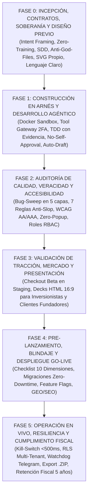

# IVC-OS: Guía de Campo para Directores de Plataformas de Vibe Coding
> **Estándar Maestro de Ciclo de Vida, Rigor de Ingeniería, Gobernanza y Operación Agéntica**  
> *Versión 2.0 (Estructura Canónica Cronológica por Fases y Niveles de Prioridad)*  
> *Septiembre 2026 — Ecosistema IVC-OS / VibeCoder*

---

## 0. Manifiesto y Marco Operativo Rector

El **Vibe Coding** representa la evolución del desarrollo de software hacia un paradigma donde el lenguaje natural funciona como la sintaxis de alto nivel de compilación digital. Sin embargo, cuando se practica sin dirección, degenera en deuda técnica descontrolada, alucinaciones silenciosas, componentes rotos, fugas de secretos y el vicio operativo conocido como **Prompt-and-Pray** (escribir prompts vagos y aceptar código a ciegas rezando para que funcione).

En el marco de **IVC-OS (Intelligent Vibe Coding Operating System)**, el ser humano al mando de la plataforma no es un espectador pasivo ni un prompteador casual. El ser humano es el **Director de Orquesta, Arquitecto en Jefe y Auditor Fiduciario**:

1. **El Director no compite con el agente en velocidad de mecanografía; compite en claridad de intención, rigor de fronteras y juicio de valor.**
2. **Ninguna línea de código de implementación se autoriza sin una especificación formal congelada previa.**
3. **El agente que programa jamás aprueba su propio código (*Regla de No Self-Approval*).**
4. **La evidencia literal de terminal y las aserciones deterministas prevalecen siempre sobre cualquier afirmación en lenguaje natural (*Verification Before Completion*).**
5. **Cero tolerancia a datos falsos, métricas ficticias o promesas que el sistema no pueda respaldar con código.**

### Taxonomía de Niveles de Prioridad
Todas las directivas y protocolos de esta guía de campo están clasificados con una etiqueta de prioridad operativa:
* `[P0 - CRÍTICO / BLOQUEANTE]`: Requisito no negociable. Si no se cumple o se viola, se detiene de inmediato la tarea, el commit o el despliegue.
* `[P1 - ALTA CALIDAD / ARQUITECTURA]`: Estándar mandatorio de ingeniería, mantenibilidad, accesibilidad y resiliencia.
* `[P2 - EXCELENCIA / TRACCIÓN & GTM]`: Prácticas de optimización comercial, sensorial, diseño y go-to-market.

---



---

## FASE 0: Incepción, Contratos, Soberanía y Diseño Previo (Día 0)

Esta fase establece las reglas del juego, los límites del sistema y la arquitectura antes de permitir que cualquier agente escriba la primera línea de código de aplicación.

### Directiva 0.1: Delimitación de Alcance y Frontera Negativa (*Intent Framing*) `[P0]`
* **Contexto / Trigger:** Inicio de cualquier proyecto, épica o módulo funcional.
* **Insumos Obligatorios:** Problema real de negocio, usuario primario, métrica cuantificable y lista explícita de exclusiones.
* **Procedimiento del Director:**
  1. **Formular la Frontera Negativa:** Definir con total precisión qué **NO** hace el sistema en esta versión. Esto previene que los agentes hiper-generen subsistemas no solicitados.
  2. **Test de Descomposición:** Si la intención del usuario involucra más de una frontera de datos o más de dos subsistemas independientes, el Director la descompone en subproyectos atómicos antes de interactuar con el primer agente.
  3. **Inyección de Restricciones Operativas:** Stack autorizado, dependencias permitidas y entorno de destino fijados de antemano.
* **Hard Gate:**
  * ❌ *NO-GO:* Requerimientos vagos como "haz una app como Uber con chat, mapas y pagos".
  *  *GO:* Alcance delimitado: *"Módulo de registro con Next.js + PostgreSQL + RLS, excluyendo pagos y mapas en esta iteración"*.

### Directiva 0.2: Soberanía de Datos y Garantía Contractual de "Cero Entrenamiento" (*Zero-Training Shield*) `[P0]`
* **Contexto:** Garantizar a inversionistas y clientes corporativos B2B que su código y datos jamás reentrenarán modelos públicos.
* **Procedimiento del Director:**
  1. **Configuración en Código:** Forzar en el Tool Gateway el uso de endpoints empresariales con retención cero (`data_retention: 0`) y cabeceras de exclusión explícita (`X-No-Train: true`).
  2. **Cláusula Contractual Fiduciaria:** Redactar en el Aviso de Privacidad la garantía inmutable:
     > *"Garantía de Soberanía Cognitiva: IVC-OS garantiza contractualmente que ninguna porción de tu código, datos de clientes o intenciones procesadas será utilizada para el reentrenamiento, ajuste fino (fine-tuning) o mejora de ningún modelo público o privado de inteligencia artificial."*

### Directiva 0.3: Blindaje de Propiedad Intelectual y Licenciamiento Permisivo `[P0]`
* **Contexto:** Incorporación de paquetes de terceros (npm, PyPI, Crates, Docker Hub).
* **Procedimiento del Director:**
  1. **Lista Blanca Estricta:** Solo se autorizan dependencias bajo licencias permisivas (MIT, Apache 2.0, BSD-2/3, ISC).
  2. **Bloqueo de Licencias Víricas:** Prohibición tajante de paquetes bajo licencias copyleft estrictas (GPL v2/v3, AGPL) en proyectos comerciales cerrados.
  3. **Trazabilidad de Commits:** Registro de autoría asistida por IA: ID del agente, ID del modelo y hash de la especificación aprobada.

### Directiva 0.4: Presupuestos de Inferencia y Disyuntores de Tokenomics (*Budget Guardrails*) `[P1]`
* **Contexto:** Prevención de gasto descontrolado en APIs de modelos de lenguaje.
* **Procedimiento del Director:**
  1. **Techo Financiero:** Asignación de presupuesto máximo en dólares por tarea (\$USD).
  2. **Umbral de Quema al 80% (Burn Rate):** Si un agente consume el 80% de su presupuesto sin emitir un pull request con pruebas en verde, el sistema se pausa automáticamente para intervención humana.
  3. **Asignación Eficiente de Modelos:**
     * *Modelos Ligeros (Flash):* Parsing, linters, scaffolding, búsquedas y documentación.
     * *Modelos Profundos (Pro / High Reasoning):* Modelado de datos, especificaciones arquitectónicas, debugging oscuro y auditoría de seguridad.

### Directiva 0.5: Spec-Driven Development (SDD) & Congelación de Contratos `[P0]`
* **Principio:** *"Ningún agente escribe código de aplicación sin una especificación formal preexistente y congelada"*.
* **Procedimiento del Director:**
  1. **Especificación Previa Obligatoria:** El agente arquitecto produce un archivo formal que contiene:
     - Modelos de datos y esquemas de validación fuertemente tipados (Zod en TypeScript, Pydantic en Python).
     - Contratos de endpoints OpenAPI (rutas, query params, headers, status codes y schemas JSON).
     - Casos de error canónicos y criterios de aceptación (Given-When-Then).
  2. **Congelación Humana:** El Director lee la especificación y la sella (`APPROVED_SPEC_HASH`).
  3. **Inmutabilidad:** Los agentes de implementación reciben la spec como verdad absoluta. Tienen prohibido modificar los tipos o schemas por iniciativa propia.

### Directiva 0.6: Regla de Modularización Estricta (Anti-God-Files < 250 líneas) `[P1]`
* **Principio:** *"Archivos gigantescos ocultan bugs y saturan la atención de los modelos de IA"*.
* **Procedimiento del Director:**
  1. **Límite Máximo de Tamaño:** Ningún archivo de código ni componente de interfaz puede superar las **250-300 líneas de código**.
  2. **Descomposición Obligatoria:** Si un archivo supera este umbral, el agente debe descomponerlo en subcomponentes de presentación, custom hooks (`useProjectWorkflow.ts`) o módulos utilitarios puros en `/lib/`.
  3. **Paquetes de Memoria Estructurados:** Mantener en la raíz `PROJECT_SPEC.md` (requisitos), `CONTEXT.md` (decisiones congeladas) y `SESSION_PRIMER.md` (paquete de contexto limpio).

### Directiva 0.7: Lenguaje Claro del Mercado Meta (Hispano / Mexicano) `[P2]`
* **Principio:** *"Erradicar la jerga técnica inflada y los anglicismos innecesarios que confunden al comprador"*.
* **Procedimiento del Director:**
  1. **Adopción de Lenguaje Claro (*Plain Language*):** Reducir acrónimos al mínimo indispensable. Privilegiar un español profesional, cálido y directo (ej. *"Comienza en 3 pasos y visualiza tus resultados al instante"* en vez de *"Seamless onboarding pipeline with automated insights"*).
  2. **Conservación Quirúrgica de Términos:** Mantener únicamente aquellos anglicismos universales cuya traducción al español distorsiona el sentido técnico (*API*, *SaaS*, *backend*, *frontend*, *webhook*, *cookies*, *login*, *dashboard*).

### Directiva 0.8: Diseño Sensorial Propio: Ilustración Vectorial SVG y Cero Stock `[P2]`
* **Principio:** *"Las fotos de stock genéricas y los íconos repetitivos degradan la credibilidad de la plataforma"*.
* **Procedimiento del Director:**
  1. **Cero Hotlinking a Bancos de Imágenes:** Prohibido usar enlaces a Unsplash, Pexels o placeholders que se rompen con el tiempo o filtran datos.
  2. **Ilustraciones Vectoriales Nativas en Código SVG (Inline SVG):** Ilustraciones programadas directamente en código: cero peticiones de red externas (0 ms de latencia), escalabilidad infinita sin pixelación y adaptación automática a temas claro/oscuro mediante variables CSS (`currentColor`).

### Directiva 0.9: Arquitectura Intuitiva de Fricción Cero (*Self-Explanatory UX*) `[P2]`
* **Objetivo:** Lograr una interfaz tan autoevidente que elimine el trabajo del equipo de ventas y la necesidad de tutoriales en video.
* **Componentes Didácticos Obligatorios:**
  1. **Guía de Flujo en 3 Pasos (`/como-funciona`):** Esquema visual interactivo: 1. Define tu objetivo → 2. El motor genera y valida → 3. Descarga o despliega.
  2. **Página de Glosario Integrado (`/glosario`):** Diccionario en lenguaje cotidiano que explica cada término técnico para usuarios novatos y compradores corporativos.

---

## FASE 1: Construcción Confinada y Desarrollo Agéntico en Arnés (Día 1)

Durante esta fase se ejecuta la generación de código bajo condiciones estrictas de confinamiento, validación y verificación mecánica.

### Directiva 1.1: Confinamiento en Sandbox Docker Efímero con *Egress Guardrail* `[P0]`
* **Principio:** *"El agente nunca opera directamente en el sistema operativo del host; trabaja confinado dentro de un arnés determinista"*.
* **Procedimiento del Director:**
  1. **Sandbox Aislado:** Contenedor Docker efímero con sistema de archivos temporal montado en modo Copy-on-Write y base de datos local en memoria.
  2. **Egress Guardrail (Control Estricto de Red Saliente):** Contenedor sin acceso libre a internet (`--network none` o lista blanca de dominios auditada). Bloqueo total de cualquier intento de enviar datos a servidores no autorizados.
  3. **Mocks Deterministas:** Toda llamada a pasarelas de pago, correos o APIs de terceros pasa por servidores mock locales en el arnés.

### Directiva 1.2: Flota de Agentes Efímeros Desechables (*Disposable Fleet*) `[P1]`
* **Principio:** *"Los agentes son trabajadores desechables de un solo uso; los repositorios y los contratos son permanentes"*.
* **Ciclo de Vida Formal:**
  `SPAWNED` → `CONTEXT_LOADED` → `EXECUTING_IN_HARNESS` → `ADVERSARIAL_AUDIT` → `COMMITTED` → `TERMINATED`.
* Al concluir cada micro-tarea, la instancia del agente se destruye para evitar que acumule basura conversacional o directivas obsoletas.

### Directiva 1.3: Tool Gateway con Matriz de Permisos por Riesgo `[P0]`
* Toda llamada a herramientas (*tool call*) debe validarse en un gateway central:
  * **Nivel 0 (Lectura local):** `view_file`, `list_dir`, `grep_search` → **Autónomo**.
  * **Nivel 1 (Escritura en sandbox):** Modificación de archivos locales en la rama temporal → **Autónomo dentro de límites**.
  * **Nivel 2 (Red y dependencias):** `npm install`, llamadas HTTP autorizadas → **Notificación en log**.
  * **Nivel 3 (Crítico / Destructivo):** Despliegue en cloud, migraciones de base de datos en producción, cobros o borrado de ramas → **HARD GATE: Requiere aprobación humana 2FA obligatoria**.

### Directiva 1.4: Context Engineering & Poda Activa de Memoria (*Context Pruning*) `[P1]`
* **Procedimiento del Director:**
  1. **Regla de Poda Activa:** Nunca pegar trazas gigantes de logs en el prompt; aislar únicamente el mensaje de error y las 10 líneas de código circundantes.
  2. **Presupuesto de Ventana de Contexto:** 15% para instrucciones y memoria (`CONTEXT.md`), 25% para fragmentos de código y esquemas de tipos, 60% libre para el espacio de razonamiento del modelo.

### Directiva 1.5: Resiliencia "Local-First" y Autoguardado de Borradores (*Auto-Draft*) `[P2]`
* **Procedimiento:** Todo formulario, editor de especificaciones y campo de texto en la plataforma se sincroniza en tiempo real en `localStorage` / `IndexedDB`. Si la conexión parpadea o el usuario cierra la pestaña por error, el borrador se restaura íntegro al volver a entrar.

### Directiva 1.6: TDD Agéntico y Evidencia Literal de Terminal Obligatoria `[P0]`
* **Principio:** *"Verification Before Completion: Ninguna tarea se da por concluida sin la salida de terminal que demuestre pruebas en verde"*.
* **Procedimiento del Director:**
  1. **Ciclo Red-Green-Refactor:** El agente primero escribe la prueba que falla (Rojo), luego el código mínimo necesario para pasarla (Verde) y finalmente refactoriza.
  2. **Evidencia Literal:** Se prohíbe aceptar afirmaciones verbales como *"el código ya funciona"*. El agente debe adjuntar el log literal del CLI de pruebas (`npm test`, `pytest`) con el conteo de suites exitosas.

### Directiva 1.7: Revisión Adversarial (*No Self-Approval*) y Micro-Diffs `[P0]`
* **Principio:** *"Ningún agente puede ser juez de su propia obra. La duda sistemática es la mejor herramienta de calidad"*.
* **Procedimiento del Director:**
  1. **Regla de No-Self-Approval:** El código emitido por el agente constructor siempre es auditado por un **segundo agente revisor en contexto limpio**, enfocado exclusivamente en encontrar vulnerabilidades y casos límite.
  2. **Micro-Diffs Atómicos (< 200 líneas):** Las entregas no deben superar las **150-200 líneas modificadas**. Si un agente propone un diff masivo de 800 líneas en 10 archivos, se rechaza y se exige modularización atómica.

### Directiva 1.8: Documentación Viva y Sincronización Inmutable de Specs `[P1]`
* **Procedimiento del Director:**
  1. **Documentación del "Por Qué" (TSDoc / Docstrings):** Comentarios que explican el *rationale* de diseño en cada interfaz y función pública, no solo lo evidente.
  2. **Sincronización Bidireccional:** Si el código se modifica durante la implementación, el archivo `PROJECT_SPEC.md` **debe actualizarse en el mismo commit**. Si hay discrepancia entre la spec y el código, el arnés rechaza el cambio (*Zero Spec Drift*).

---

## FASE 2: Auditoría Avanzada de Calidad, Veracidad y Accesibilidad (Día 2)

Cuando los módulos principales están codificados, el Director detiene la adición de nuevas features y somete el sistema a un escaneo profundo de estabilidad, veracidad e inclusión.

### Directiva 2.1: El "Bug-Sweep" para Proyectos Avanzados en 5 Capas `[P1]`
* **Contexto:** Auditoría profunda de estabilidad del código maduro.
* **Procedimiento del Director:** Activar al agente auditor en modo solo-lectura para inspeccionar:
  1. *Capa 1: Invariantes y Tipado Estricto:* `tsc --noEmit`, detección de `any` y castings forzados (`as unknown as T`).
  2. *Capa 2: Asincronía y Concurrencia:* Promesas sin `try/catch`, estados de carga rotos y fugas de memoria en `useEffect`/WebSockets.
  3. *Capa 3: Resiliencia de Rutas:* Slugs no controlados, redirects cíclicos y enlaces rotos.
  4. *Capa 4: Fuzzing de Entradas:* Resistencia a strings vacíos, payloads gigantes de 10,000 caracteres, emojis o números negativos.
  5. *Capa 5: Fuga de Secretos:* Escaneo de tokens de API expuestos en el código del frontend.
* **Entregable:** Emisión del `BUG_REGISTRY.md` con severidades P0, P1, P2 y resolución atómica de **un bug por commit**.

### Directiva 2.2: Las 7 Reglas de Oro de Veracidad y Anti-Slop `[P0]`
1. **Mandato de Cero Prueba Social Falsa:** Si el proyecto no tiene clientes reales, **la sección de testimonios se elimina**. Se sustituye por una **Demostración de Mecanismo en Vivo (*Proof of Mechanism*)**: playground o simulador interactivo donde el visitante prueba el motor con sus propias manos.
2. **Prueba del Hecho Verificable:** Todo número cuantitativo en el copy debe derivar de un benchmark comprobable en el código. Prohibido *"Ahorra 90% de tiempo"*; usar *"Reduce la configuración de 7 pasos a 1 comando"*.
3. **Empty-State First Discipline:** Programar obligatoriamente la pantalla pensando en el usuario con 0 registros (ilustración sobria y botón visible *"Crea tu primer proyecto"*). Los datos de prueba deben vivir aislados en `src/mocks/fixtures.ts` con bandera `VITE_USE_MOCKS=true`, nunca hardcodeados en el JSX de producción.
4. **Mandato Anti-Placeholders:** Cero `// TODO: implement later`, cero `Lorem Ipsum` y cero botones decorativos sin función real.
5. **Zero Dead-Ends:** Cero enlaces a `href="#"`; toda opción en navbar o footer debe resolver a una página funcional.
6. **The Benefit Test:** Someter cada feature a la prueba de dos preguntas: *"¿Y qué?"*.
7. **Pre-Flight Veracity Audit:** Si hay nombres inventados, usuarios falsos o logos no autorizados → **RECHAZO INMEDIATO**.

### Directiva 2.3: Estándar Mundial de Accesibilidad e Inclusión (WCAG 2.1/2.2 AA/AAA) `[P1]`
1. **Contraste Matemático:** Mínimo 4.5:1 en texto normal (AA) y > 7:1 en elementos de acción y alertas (AAA).
2. **Navegación 100% por Teclado:** Toda acción interactiva ejecutable con `Tab`, `Shift+Tab`, `Enter` y flechas; indicadores de foco visibles con `:focus-visible` y skip link (`.skip-link`).
3. **Soporte Neurodivergente:** Espaciado conforme a WCAG 1.4.12 y respeto estricto a `prefers-reduced-motion` para personas con TDAH o hipersensibilidad vestibular.

### Directiva 2.4: Mandato Zero-Popup `[P1]`
* Prohibición terminante de ventanas modales flotantes que desbordan pantallas móviles o atrapan lectores de pantalla.
* Toda interacción compleja debe resolverse en una **subpágina dedicada con URL limpia y botón de regreso inteligente**, o en paneles integrados con scroll nativo.

### Directiva 2.5: Arquitectura y Gobierno de Roles SaaS (RBAC) `[P0]`
* Separación estricta de privilegios:
  * **End User:** Acceso a sus proyectos asignados dentro de su organización.
  * **Tenant Admin:** Gestión de miembros del equipo, facturación y llaves de API.
  * **Superadmin:** Panel interno `/superadmin` protegido por IP y 2FA, métricas globales de sistema, **suplantación de soporte auditada (*impersonation* con banner visible)** y override de cuotas.
* **Defense in Depth:** Validación del trinomio `(user, role, tenant_id)` a nivel API en cada endpoint, nunca confiando solo en el frontend.

---

## FASE 3: Validación de Tracción, Mercado y Presentación Comercial (Día 3)

Esta fase capacita al Director para captar clientes fundadores, validar disposición de pago y presentar el proyecto a inversionistas de capital sin fricción operativa.

### Directiva 3.1: Pasarelas de Pago en Modo Staging / Beta Pública `[P1]`
* **Patrón "Intent-Capture / Frictionless Beta Checkout":** Permite validar tracción y conversión mientras se tramitan las cuentas de Stripe/MercadoPago:
  1. Se muestran los planes y precios reales (ej. *Pro: $79 USD/mes*).
  2. El botón dice: *"Activar Acceso Beta Fundador"*.
  3. El modal captura los datos del cliente, registra la transacción como `beta_trial_active` con descuento vitalicio congelado en base de datos y le otorga acceso inmediato de cortesía por 30 días sin solicitar tarjeta de crédito.
  4. Valida la **intención de pago real y la tasa de conversión** desde el día cero.

### Directiva 3.2: Generación de Decks en HTML 16:9 para Inversionistas `[P2]`
* Formato de presentación en **un solo archivo HTML autocontenido (`deck-investor.html`)**, relación 16:9, navegación por teclado y tipografía *Syne* + *JetBrains Mono*:
  1. *Slide 1:* Portada y tesis de inversión (*one-liner* contundente).
  2. *Slide 2:* El dolor del mercado (*The Burning Problem*).
  3. *Slide 3:* La solución y el mecanismo único de IVC-OS.
  4. *Slide 4:* Demostración visual del producto en funcionamiento.
  5. *Slide 5:* Tamaño de mercado (TAM / SAM / SOM).
  6. *Slide 6:* Modelo de negocio y economía unitaria (*Unit Economics*).
  7. *Slide 7:* Foso defensivo (*The Moat*: arneses, RAG, memorias y gobernanza).
  8. *Slide 8:* Tracción y métricas reales de la cohorte beta.
  9. *Slide 9:* Equipo fundador y capacidad de ejecución.
  10. *Slide 10:* The Ask (capital buscado, uso de fondos e hitos a 18 meses).

### Directiva 3.3: Generación de Decks en HTML 16:9 para Clientes Fundadores `[P2]`
* Presentación de ventas B2B de 6 slides (`deck-founders.html`):
  1. *Slide 1:* Diagnóstico de tu problema operativo (*"¿Cuánto tiempo y dinero pierdes hoy?"*).
  2. *Slide 2:* El Antes vs. El Después.
  3. *Slide 3:* Demostración en 3 pasos (Intención → Arnés → Software).
  4. *Slide 4:* Oferta de Socio Fundador (descuento vitalicio y canal directo con ingeniería).
  5. *Slide 5:* Blindaje y garantía de cero riesgo (exportación total de datos).
  6. *Slide 6:* Llamado a la acción (reserva de cupo en la cohorte).

### Directiva 3.4: Modo Sombra para Evaluación Ciega de Nuevos Modelos de IA `[P2]`
* Enrutamiento del 10% del tráfico no crítico a nuevos modelos candidatos en segundo plano. Comparación silenciosa de latencia, costo y tasa de pruebas en verde frente al modelo titular antes de autorizar la migración oficial.

---

## FASE 4: Pre-Lanzamiento, Blindaje de Release y Despliegue Go-Live (Día 4)

Compuerta previa al paso a producción. Garantiza que el sistema esté blindado técnica, legal y visualmente.

### Directiva 4.1: Checklist Pre-Lanzamiento: Las 10 Dimensiones Críticas de Despegue `[P0]`
El Director corre una auditoría binaria con 10 compuertas no negociables:
1. **Seguridad:** Secretos fuera del frontend, CSP, HSTS y CORS restrictivo.
2. **Resiliencia:** Páginas 404 y 500 personalizadas y timeouts en todas las APIs.
3. **Metadatos & SEO:** OpenGraph (`og:image` 1200x630px), Twitter Cards, `robots.txt` y favicons completos.
4. **Accesibilidad:** WCAG AA en contrastes, navegación por teclado y skip links.
5. **Rendimiento:** Imágenes en WebP/AVIF con dimensiones explícitas y LCP < 2.5s.
6. **Cumplimiento Legal:** Aviso de Privacidad y Términos de Servicio actualizados.
7. **Telemetría:** Logger/Sentry configurado con filtro estricto de PII.
8. **Base de Datos:** Migraciones probadas e índices en llaves foráneas.
9. **Responsividad:** Vista validada en 375px móvil, 768px tablet y 1440px desktop sin scroll horizontal involuntario.
10. **Critical User Journey:** Flujo central de registro, uso principal y cierre de sesión probado de punta a punta.
* **Veredicto:** 10/10 Aprobados = **GO**; cualquier punto pendiente = **NO-GO**.

### Directiva 4.2: Migraciones de Base de Datos "Zero-Downtime" (*Expand & Contract Pattern*) `[P0]`
* Prohibición de `ALTER TABLE` destructivos en caliente.
* Ciclo en 3 fases:
  1. *Fase 1 (Expandir):* Agregar nueva columna sin borrar la vieja; el código escribe en ambas y lee con fallback.
  2. *Fase 2 (Migrar):* Script en segundo plano para poblar datos históricos sin bloquear lecturas ni escrituras.
  3. *Fase 3 (Contraer):* Eliminación de la columna vieja únicamente tras 72 horas de estabilidad en producción.

### Directiva 4.3: Despliegue Silencioso y Banderas de Función (*Feature Flags & Dark Launching*) `[P1]`
* Toda nueva funcionalidad nace apagada (`ENABLE_X=false`) y se libera escalonadamente: Superadmin → Cohorte Beta (10%) → Disponibilidad General al 100%. Desactivable en un clic ante cualquier anomalía.

### Directiva 4.4: Optimización Integral Post-Proyecto: SEO, SEM y GEO `[P1]`
1. **SEO Técnico:** Marcado HTML5 semántico y jerarquía H1/H2/H3 estricta.
2. **SEM Ready:** Landing pages alineadas con la promesa del anuncio y LCP < 2.0s para maximizar el *Quality Score*.
3. **GEO (Generative Engine Optimization para IA):**
   * Archivo `llms.txt`: Resumen ejecutivo estructurado para ChatGPT, Claude, Perplexity y Gemini.
   * Archivo `llms-full.txt`: Documentación técnica completa en markdown puro.
   * Archivo `ai.txt`: Permisos de consumo para agentes.
   * Marcado estructurado JSON-LD con vocabularios Schema.org (`SoftwareApplication`, `Organization`, `FAQPage`) y prerenderizado estático en SPAs.

---

## FASE 5: Operación en Vivo, Resiliencia, Gobernanza y Cumplimiento Fiscal (Día 5+)

Gobernanza operativa continua de la plataforma en producción, gestión de crisis y cumplimiento legal fiduciario.

### Directiva 5.1: Botón de Desconexión de Emergencia de Agentes (*Global Kill-Switch*) `[P0]`
* Botón de dos pasos en el panel de Superadmin que en menos de 500 ms:
  1. Envía `SIGKILL` a los contenedores Docker en el arnés.
  2. Revoca de golpe todos los tokens de sesión efímeros.
  3. Pone a la plataforma en **Modo Seguro de Solo-Lectura** con mensaje informativo a los usuarios.

### Directiva 5.2: Aislamiento Multi-Tenant Estricto con RLS y Particionado Vectorial `[P0]`
* Todo query en base de datos debe incluir `tenant_id` con políticas activas de **Row-Level Security (RLS)** en PostgreSQL.
* Particionado mandatorio de colecciones en `pgvector` por `tenant_id`: ningún query de RAG puede ejecutarse sin el filtro explícito de tenant.

### Directiva 5.3: Centinela Silencioso de Alertas Críticas (*Watchdog Bot a Telegram / Discord*) `[P1]`
* Webhook ligero que notifica al Director únicamente ante 4 eventos críticos:
  1. 🚨 Error 500 no controlado en producción.
  2. 💳 Nuevo cliente registrado o checkout beta completado.
  3. ⚠️ Consumo de inferencia al 80% del presupuesto diario.
  4. 🛑 Agente abortado por disyuntor de seguridad.

### Directiva 5.4: Soberanía del Cliente y Exportación Total en 1 Clic (*Zero Vendor Lock-In*) `[P1]`
* Botón en configuración: *"Exportar Todos Mis Proyectos (.ZIP)"*.
* Descarga inmediata del código fuente limpio, esquemas SQL DDL, especificaciones Markdown y activos SVG, eliminando el miedo al compromiso en ventas B2B.

### Directiva 5.5: Ciclo de Vida de Eliminación de Cuenta con Retención Fiscal Obligatoria de 5 Años `[P0]`
* Resuelve el derecho al olvido frente a las obligaciones fiscales (Art. 30 CFF / IRS / CRA):
  1. **Purgado Inmediato del Perfil:** Sesiones revocadas, contraseñas eliminadas, datos personales anonimizados (`anonymized_{sha256(email)}@deleted.local`) y código en sandbox destruido.
  2. **Statutory Tax Hold (Libro Mayor Inmutable):** Las tablas de facturación y transacciones (`billing_transactions`, `invoices`, `cfdi_records`) se marcan con `statutory_tax_hold = TRUE` y se conservan bloqueadas por **5 años** obligatorios.
  3. **Vista de Cumplimiento:** Accesible únicamente por el Superadmin/Auditor en `/admin-platform/compliance-tax`.

### Directiva 5.6: Observabilidad Distribuida con OpenTelemetry `[P1]`
* Todo flujo genera un `TraceId` único que vincula la intención del usuario, la especificación, los subagentes ejecutores, las llamadas a herramientas y los commits generados.

---

## APÉNDICES NORMATIVOS

### Apéndice A: Catálogo de Anti-Patrones Letales del Vibe Coding

| Anti-Patrón | Síntomas | Consecuencia Catastrófica | Antídoto del Director |
|---|---|---|---|
| **1. Prompt-and-Pray** | Lanzar prompts vagos y aceptar código sin correr pruebas. | Código espagueti y bugs indetectables que estallan en producción. | **Spec-Driven Development (SDD)** + Verificación obligatoria de terminal. |
| **2. Self-Approval Trap** | Preguntarle al mismo agente que programó si su código está bien. | Falsa sensación de seguridad por sesgo de confirmación del LLM. | **Doubt-Driven Development**: agente revisor adversarial en contexto limpio. |
| **3. Context Blindness** | Pegar logs gigantescos de 50,000 tokens en la misma conversación. | Alucinaciones severas y olvido de instrucciones previas por saturación. | **Poda de contexto (Pruning)** y sesiones limpias con `SESSION_PRIMER.md`. |
| **4. Synthetic Traction** | Dejar que el agente invente testimonios, usuarios falsos y logos corporativos. | Destrucción de la reputación de la empresa y riesgo legal de fraude. | **Mandato de Cero Prueba Social Falsa** + Demos de mecanismo en vivo. |
| **5. Monolithic Mega-Diff**| Permitir que el agente altere 15 archivos y 1,000 líneas a la vez. | Imposibilidad de auditar el código y regresiones silenciosas. | **Micro-Diffs (< 200 líneas)** y modularización (< 250 líneas por archivo). |
| **6. Infinite Debug Loop** | Dejar al agente intentar solucionar el mismo fallo en bucle más de 3 veces. | Quema masiva de tokens (\$50 USD tirados en minutos) sin resolver la causa raíz. | **Circuit Breakers**: Congelación forzada al 3er intento y análisis de causa raíz. |

---

### Apéndice B: Runbook de Emergencia y Respuesta ante Deriva (*Drift Response Playbook*)

* **Emergencia 1: Deriva Arquitectónica (*Architectural Drift*):**
  1. Abortar el proceso del agente de inmediato en el arnés.
  2. Ejecutar rollback forzado: `git reset --hard HEAD` y `git clean -fd`.
  3. Purgar la memoria del agente y re-anclarlo con la especificación inmutable y su lista de fronteras negativas.
* **Emergencia 2: Intento de Fuga en Sandbox (*Egress Violation*):**
  1. Congelar el contenedor Docker (`docker pause`).
  2. Rotar de inmediato cualquier secreto inyectado en el arnés.
  3. Ejecutar análisis estático con Semgrep buscando paquetes maliciosos o código ofuscado.
* **Emergencia 3: Bucle de Depuración Ciego (*Infinite Debugger*):**
  1. El disyuntor corta la tarea al tercer fallo consecutivo.
  2. Invocar una sesión independiente bajo el protocolo de análisis de causa raíz (`error-diagnosis`).
  3. El Director corrige la especificación antes de autorizar cualquier nueva línea de código.

---

### Apéndice C: Matriz Maestra de Compuertas de Decisión (Hard Gates Go / No-Go)

```
========================================================================================
COMPUERTA                    CRITERIO DE RECHAZO (NO-GO)          CRITERIO DE APROBACIÓN (GO)
========================================================================================
Gate 1: Especificación       Código iniciado sin spec firmada      Spec en markdown con tipos Zod
(Spec Freeze Gate)           o tipos ambiguos (any / unknown).     congelados y casos Given-When-Then.
----------------------------------------------------------------------------------------
Gate 2: Modularización       Archivos superiores a 300 líneas     Archivos modulares < 250 líneas con
(Anti-God-Files Gate)        o código espagueti indocumentado.     TSDoc/docstrings explicando el rationale.
----------------------------------------------------------------------------------------
Gate 3: Veracidad Visual     Testimonios de stock, usuarios        Cero prueba social falsa. Empty
(Veracity & Anti-Slop Gate)  ficticios o botones muertos (href=#). state programado. Enlaces reales.
----------------------------------------------------------------------------------------
Gate 4: Arnés y Pruebas      Sin pruebas automatizadas o reporte   Suite de pruebas pasando en verde
(TDD Verification Gate)      verbal del agente sin salida de cli.  con log literal de terminal.
----------------------------------------------------------------------------------------
Gate 5: Tamaño de Entrega    Diff superior a 200 líneas de         Micro-diff atómico enfocado en
(Micro-Diff Gate)            código o más de 3 archivos a la vez.  un solo propósito verificable.
----------------------------------------------------------------------------------------
Gate 6: Revisión Adversarial Código revisado por el mismo agente   Reporte de aprobación de un agente
(No Self-Approval Gate)      que programó la solución.             revisor independiente en contexto limpio.
----------------------------------------------------------------------------------------
Gate 7: Pre-Lanzamiento      Cualquier punto pendiente en la       10/10 dimensiones aprobadas: seguridad,
(Go-Live Gate)               checklist de 10 dimensiones.          a11y WCAG, SEO/GEO, legal y resiliencia.
----------------------------------------------------------------------------------------
Gate 8: Seguridad & Egress   Secretos expuestos, licencias GPL     Escaneo Semgrep limpio, licencias MIT/
(Hardening & Fiscal Gate)    víricas o borrado de datos fiscales.  Apache 2.0 y retención fiscal por 5 años.
========================================================================================
```

---

## Conclusión y Transición hacia la Web App de IVC-OS

Con la estructuración canónica de esta **Guía de Campo de Dirección** organizada en **Fases Cronológicas (0 a 5) y Niveles de Prioridad (P0, P1, P2)**, el proyecto IVC-OS cuenta con el estándar operativo más claro, estructurado e implacable de la industria.

Cada persona o equipo que dirija una plataforma de vibe coding tiene en sus manos una guía de vuelo que elimina la improvisación, garantiza la soberanía de los datos, blinda el código contra el espagueti y prepara el software para el mercado con tracción real.

**Siguiente Paso Estratégico:**  
Habiendo establecido y sellado este método rector, el proyecto se encuentra formalmente listo para activar la **Fase 2: Plan de Arquitectura y Construcción de la Web App de IVC-OS**.
