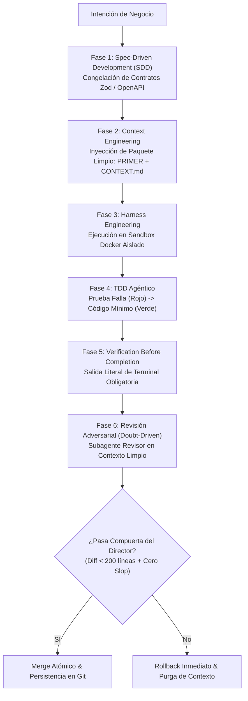

# IVC-OS: Guía de Campo para Directores de Plataformas de Vibe Coding
> **Estándar Maestro de Dirección Estratégica, Rigor de Ingeniería y Gobernanza de Flotas de Agentes**  
> *Versión 1.0 — Septiembre 2026 — Ecosistema IVC-OS / VibeCoder*

---

## 0. Manifiesto y Rol Rector del Director de Vibe Coding

El **Vibe Coding** representa una de las mayores transmutaciones en la historia de la computación: el lenguaje natural se convierte en la sintaxis de invocación y compilación de sistemas digitales. Sin embargo, sin dirección formal, el vibe coding degenera invariablemente en deuda técnica exponencial, alucinaciones silenciosas, componentes rotos, fugas de secretos y el vicio operativo conocido como **Prompt-and-Pray** (promptear a ciegas y rezar para que funcione).

En el marco de **IVC-OS (Intelligent Vibe Coding Operating System)**, el ser humano al mando de la plataforma no es un espectador pasivo ni un simple escritor de prompts casuales. El ser humano es el **Director de Orquesta, Arquitecto en Jefe y Auditor Fiduciario**:

1. **El Director no compite con el agente en velocidad de escritura; compite en claridad de intención, rigor de frontera y juicio de valor.**
2. **Ninguna línea de código de implementación se autoriza sin una especificación congelada previa.**
3. **El agente que programa jamás aprueba su propio código (*Regla de No Self-Approval*).**
4. **La evidencia de terminal y las aserciones deterministas prevalecen siempre sobre cualquier afirmación en lenguaje natural (*Verification Before Completion*).**
5. **Cero tolerancia al software de utilería, datos falsificados o promesas que el sistema no puede respaldar con código.**

---

## 1. Eje I: Dirección Estratégica & Gobernanza de Intención (Nivel CPO / Founder / Director)

### Protocolo 1.1: Ingeniería de Intención y Delimitación de Alcance (*Intent Framing*)
* **Contexto / Trigger:** Inicio de cualquier proyecto, épica o módulo funcional dentro de la plataforma.
* **Insumos Obligatorios (Inputs):** Problema real de negocio, usuario beneficiario primario, métrica de éxito cuantificable y lista explícita de exclusiones.
* **Procedimiento del Director:**
  1. **Formular la Frontera Negativa:** Antes de describir qué hace la funcionalidad, el Director define qué **NO** hace. Esto evita que los agentes hiper-generen subsistemas innecesarios.
  2. **El Test de Descomposición:** Si la intención del usuario o founder involucra más de una frontera de datos o más de dos subsistemas independientes, el Director la descompone en sub-proyectos atómicos antes de interactuar con el primer agente.
  3. **Inyección de Restricciones Operativas:** Se fijan de antemano el stack permitido, las dependencias autorizadas y el entorno de destino.
* **Hard Gate (Go / No-Go):**
  * ❌ *NO-GO:* Si el requerimiento dice "haz una app como Uber pero para pasear perros con chat, pagos y mapas en tiempo real", se rechaza inmediatamente por falta de delimitación.
  *  *GO:* Se aprueba únicamente cuando el alcance se restringe a: *"Módulo de registro y autenticación con Next.js + PostgreSQL + RLS, excluyendo pagos y mapas en esta iteración"*.

---

### Protocolo 1.2: Tokenomics y Presupuestos de Inferencia (*Budget Guardrails*)
* **Contexto / Trigger:** Asignación de recursos de computación e inferencia para cada tarea delegada a agentes.
* **Insumos Obligatorios:** Presupuesto en dólares por tarea (\$USD), cuota máxima de tokens por ventana de contexto y tasa de llamadas a API por minuto.
* **Procedimiento del Director:**
  1. **Asignación de Techos Financieros:** Ningún agente recibe autonomía presupuestaria ilimitada. Se establece un tope duro por tarea atómica (ej. \$1.50 USD por micro-módulo; \$10.00 USD por feature compleja).
  2. **Umbral de Alerta Temprana (80% Burn Rate):** Si la flota de agentes consume el 80% del presupuesto asignado sin haber emitido un pull request con pruebas en verde, el sistema congela la ejecución.
  3. **Optimización de Modelo según Complejidad:**
     * *Modelos Ligeros / Flash:* Búsqueda, parsing, linters, scaffolding inicial y redacción de documentación.
     * *Modelos de Razonamiento Profundo / Pro / High:* Diseño de especificaciones, modelado de esquemas de datos, debugging de errores oscuros y auditoría de seguridad adversarial.
* **Hard Gate:**
  * ❌ *NO-GO:* Agente consumiendo más de 3 ciclos de razonamiento sin generar un artefacto verificable o diff ejecutable. El arnés revoca permisos de inferencia de inmediato.

---

### Protocolo 1.3: Blindaje de Propiedad Intelectual y Licenciamiento
* **Contexto / Trigger:** Inclusión o sugerencia de paquetes de terceros (npm, PyPI, Crates, Docker Hub).
* **Insumos Obligatorios:** Manifiesto de dependencias (`package.json`, `requirements.txt`) y reporte de licencias de dependencias transitivas.
* **Procedimiento del Director:**
  1. **Lista Blanca de Licencias:** Solo se autorizan dependencias bajo licencias permisivas (MIT, Apache 2.0, BSD-2/3, ISC).
  2. **Bloqueo de Licencias Víricas:** Se prohíbe terminantemente la incorporación de paquetes bajo licencias copyleft estrictas (GPL v2/v3, AGPL) a menos que el proyecto de la plataforma haya sido declarado legalmente como open-source puro bajo esa misma licencia.
  3. **Trazabilidad Criptográfica de Generación:** Cada commit emitido en la plataforma debe registrar metadatos de autoría: ID del agente, ID del modelo, hash de la especificación fuente y firma GPG/SSH del runtime de la plataforma.

---

### Protocolo 1.4: Prevención de Alucinación Sistémica y Deriva de Producto (*Anti-Feature Creep*)
* **Contexto / Trigger:** Revisión de planes generados por los agentes previo a la codificación.
* **Insumos Obligatorios:** Documento de especificación contra propuesta de cambios.
* **Procedimiento del Director:**
  1. **Inspección de Sobregiro Funcional:** Identificar si el agente ha propuesto dependencias accesorias (ej. agregar Redux cuando solo se necesitaba estado local, o montar un cluster Kafka para un MVP de 10 usuarios).
  2. **YAGNI Implacable (*You Aren't Gonna Need It*):** Podar activamente cualquier sugerencia que pretenda anticiparse a problemas que el negocio no tiene hoy.
  3. **Inmutabilidad del Contrato:** Si un agente detecta una "mejora de producto", no puede implementarla motu proprio; debe registrarla en un archivo de notas (`BACKLOG_CANDIDATES.md`) y ceñirse estrictamente a la especificación activa.

---

## 2. Eje II: Dirección Técnica & Tríada de Blindaje Operativo (Lead Architect / Manager)

Este eje es el corazón de la ingeniería de software moderna con agentes. Se basa en tres pilares indestructibles: **Spec-Driven Development (SDD)**, **Context Engineering** y **Harness Engineering**.



---

### Protocolo 2.1: Spec-Driven Development (SDD) & Congelación de Contratos
* **Principio:** *"Ningún agente escribe código de aplicación sin una especificación formal preexistente y congelada"*.
* **Procedimiento del Director:**
  1. **Generación de la Especificación:** El agente arquitecto produce un archivo de especificación que contiene:
     - Modelos de datos y esquemas de validación fuertemente tipados (Zod en TypeScript, Pydantic en Python).
     - Contrato de interfaces de API (rutas, query params, headers, status codes y schemas de respuesta JSON).
     - Comportamiento ante errores (códigos de error canónicos, estructura del mensaje de fallo).
     - Invariantes de negocio y criterios de aceptación (Gherkin / Given-When-Then).
  2. **Revisión y Congelación Humana:** El Director lee la especificación, valida que represente la intención y la sella (`APPROVED_SPEC_HASH`).
  3. **Prohibición de Código Suelto:** Los agentes constructores reciben la especificación como única fuente de verdad. Tienen prohibido modificar los contratos de tipos durante la fase de implementación. Si un agente descubre que un tipo es insuficiente, debe solicitar una pausa para modificar la especificación, no improvisar en el código.

---

### Protocolo 2.2: Context Engineering & Memoria Persistente de Proyecto
* **Principio:** *"La calidad del código generado por un modelo es directamente proporcional a la densidad y pureza de su ventana de contexto"*.
* **Patología a Evitar:** *Context Rot* (degradación cognitiva provocada por meter cientos de líneas de logs ruidosos o archivos irrelevantes en el chat).
* **Procedimiento del Director:**
  1. **Estructuración en 3 Archivos Maestros de Memoria:**
     * `PROJECT_SPEC.md`: El qué y el por qué del módulo.
     * `CONTEXT.md`: El estado actual del sistema, decisiones arquitectónicas tomadas y restricciones vigentes.
     * `SESSION_PRIMER.md`: Paquete de inicio rápido para instanciar cualquier sesión o agente nuevo sin gastar tokens de bienvenida.
  2. **Regla de Poda Activa (*Context Pruning*):**
     * Nunca inyectar trazas de stack trace completas de 500 líneas; inyectar únicamente el mensaje de error y las 10 líneas de código circundantes.
     * Al concluir cada ciclo de desarrollo, resumir las decisiones clave en `CONTEXT.md` y desechar el historial de conversación anterior.
  3. **Presupuesto de Ventana:**
     * Máximo 15% de la ventana de contexto para instrucciones del sistema y memoria del proyecto.
     * Máximo 25% para fragmentos de código relevantes y esquemas de tipos.
     * 60% libre para el espacio de razonamiento y generación de diffs.

---

### Protocolo 2.3: Harness Engineering & Sandboxing de Ejecución
* **Principio:** *"El agente nunca programa directamente en el sistema host ni en entornos compartidos; opera dentro de un arnés de confinamiento determinista"*.
* **Componentes del Arnés:**
  1. **Sandbox Docker Efímero:**
     * Cada tarea corre en un contenedor aislado con sistema de archivos temporal montado en modo Copy-on-Write.
     * Base de datos PostgreSQL con extensión `pgvector` inicializada mediante migraciones automáticas en memoria.
  2. **Egress Guardrail (Blindaje de Fuga de Red):**
     * El contenedor tiene prohibido el acceso a Internet no regulado (`--network none` o firewall con lista blanca estricta).
     * El agente no puede enviar código, credenciales o datos a servidores externos desconocidos.
  3. **Mocks Deterministas:** Las integraciones con pasarelas de pago (Stripe), correos (Resend) o APIs de terceros deben pasar por servidores mock locales en el arnés.
  4. **Intercepción y Telemetría de Comandos:** Cada comando bash/powershell ejecutado dentro del arnés queda registrado en un log inmutable con su timestamp y código de salida.

---

### Protocolo 2.4: Las 7 Reglas de Oro de Veracidad, Anti-Slop y Kickoff

Cuando un agente comienza a diseñar interfaces, landing pages o componentes visuales, el Director aplica obligatoriamente las **7 Reglas de Oro**:

#### 1. Mandato de Cero Prueba Social Falsa (*Zero-Fabricated-Proof*)
* **Prohibición Absoluta:** Jamás generar testimonios con nombres falsos (*"John Doe, CEO de Initech"*), fotos de personas de bancos de imágenes o contadores de tracción inflados (*"+10,000 clientes felices"*).
* **Solución Día 0:** Si el proyecto no tiene clientes reales, **la sección de testimonios se suprime por completo**. Se sustituye por una **Demostración de Mecanismo en Vivo (Proof of Mechanism)**: un widget interactivo, simulador o playground donde el usuario prueba la tecnología con sus propias manos.

#### 2. La Prueba del Hecho Verificable (*Verifiable Claims Only*)
* Todo número cuantitativo en el copy debe derivar de un benchmark comprobable en el repositorio.
* Prohibido: *"Ahorra 90% de tiempo en tu equipo"*.
* Permitido: *"Reduce el flujo de configuración de 7 pasos manuales a 1 comando"*.

#### 3. Disciplina de "Estado Vacío Primero" (*Empty-State First*)
* Los agentes tienden a poblar las tablas con datos falsos (gráficas con millones de pesos facturados).
* El Director exige programar primero el **Empty State**: ¿Cómo se ve la pantalla cuando el usuario tiene 0 registros? Con una ilustración sobria, una explicación clara y un botón de acción primaria visible (*"Crea tu primer proyecto"*).
* Los datos de prueba deben vivir estrictamente en un archivo `src/mocks/fixtures.ts` con una bandera de entorno (`VITE_USE_MOCKS=true`), nunca hardcodeados en el JSX de producción.

#### 4. Mandato Anti-Placeholders (*Zero-Slop Enforcement*)
* Cero comentarios tramposos: `// TODO: implement later`, `// ... rest of logic`, `// add more here`.
* Cero texto de relleno `Lorem Ipsum`.
* Todo botón debe ejecutar una función real. Si un botón dice *"Descargar Reporte"*, o descarga el documento real o no se dibuja en la pantalla. Cero utilería de cartón.

#### 5. Arquitectura "Zero Dead-Ends" (Cero Callejones sin Salida)
* Todo link en el navbar o footer debe resolver a una página real con contenido veraz.
* Los enlaces a `href="#"` están terminantemente prohibidos en las entregas del agente.

#### 6. El "Benefit Test" (Beneficio Real sobre Jerga Artificial)
* Someter cada descripción de feature a la prueba de dos preguntas: *"¿Y qué?"*.
* La IA escribe: *"Motor de procesamiento neuronal asíncrono con Web Workers"*.
* La corrección del Director: *"La pantalla nunca se congela mientras se exportan tus archivos"*.

#### 7. Checklist de Pre-Vuelo de Veracidad del Director
Antes de aprobar cualquier entrega visual, el Director valida esta lista de control:
* [ ] ¿Hay nombres o fotos de clientes inexistentes? → **RECHAZO INMEDIATO**.
* [ ] ¿Hay métricas de usuarios o facturación no respaldadas por la base de datos? → **RECHAZO INMEDIATO**.
* [ ] ¿Hay logos de corporativos usados sin convenio o autorización explícita? → **RECHAZO INMEDIATO**.
* [ ] ¿El estado con 0 registros es completamente funcional y amigable? → **APROBADO**.

---

### Protocolo 2.5: TDD Agéntico & Evidencia Obligatoria (*Verification Before Completion*)
* **Principio:** *"Una tarea no se considera resuelta hasta que el arnés entrega la salida de terminal que demuestra que las pruebas pasaron en verde"*.
* **Procedimiento del Director:**
  1. **Fase Roja (Red):** El agente escribe una prueba automatizada que describe el comportamiento esperado según la especificación. La prueba se ejecuta y **debe fallar** demostrando que el código aún no existe.
  2. **Fase Verde (Green):** El agente genera el código mínimo necesario para que la prueba pase.
  3. **Fase de Refactorización (Refactor):** Se limpia el código manteniendo las pruebas pasando.
  4. **Entrega de Evidencia de Terminal:** El agente tiene prohibido decir frases como *"el código ha sido actualizado y funciona perfectamente"*. La entrega obligatoria debe incluir el bloque de salida de consola literal:
     ```bash
     $ npm test -- --runInBand
     PASS  tests/auth/login.test.ts
       ✓ should authenticate valid credentials with secure JWT (42 ms)
       ✓ should reject expired token with 401 Unauthorized (12 ms)
     Tests: 2 passed, 2 total
     Snapshots: 0 total
     Time: 1.245 s
     Ran all test suites.
     ```

---

### Protocolo 2.6: Revisión Adversarial & Micro-Diffs (*Doubt-Driven Development*)
* **Principio:** *"Ningún agente puede ser el juez de su propia obra. La duda sistemática es la mejor herramienta de control de calidad"*.
* **Procedimiento del Director:**
  1. **La Regla de No-Self-Approval:** Cuando el agente constructor (*Implementer Agent*) concluye su trabajo, el Director invoca a un **Agente Revisor Adversarial (*Code Reviewer*)** en un contexto limpio e independiente.
  2. **Misión del Agente Revisor:** Su misión no es felicitar al constructor, sino intentar romper la solución:
     - Buscar condiciones de carrera en operaciones asíncronas.
     - Detectar inyecciones SQL, XSS o consumo desprotegido de memoria.
     - Validar que no se hayan roto contratos previos.
  3. **Límite de Micro-Diffs:**
     - El pull request no debe exceder las **150-200 líneas de código modificadas**.
     - Si un agente presenta un diff de 800 líneas repartidas en 12 archivos, el Director rechaza el lote y le ordena entregarlo en fases incrementales atómicas.

---

## 3. Eje III: Operación de Plataforma, Flotas de Agentes & Multi-Tenancy (Platform & SaaS Operator)

### Protocolo 3.1: Aislamiento Multi-Tenant Estricto (*Tenant Boundary Enforcement*)
* **Contexto:** Garantizar que los agentes que trabajan para el Cliente A jamás lean, modifiquen o alucinen con datos del Cliente B.
* **Procedimiento del Director:**
  1. **Aislamiento en Base de Datos:** Toda tabla multi-inquilino debe incorporar la columna `tenant_id UUID NOT NULL` con políticas activas de **Row-Level Security (RLS)** en PostgreSQL:
     ```sql
     ALTER TABLE projects ENABLE ROW LEVEL SECURITY;
     CREATE POLICY tenant_isolation_policy ON projects
       FOR ALL USING (tenant_id = current_setting('app.current_tenant_id')::uuid);
     ```
  2. **Aislamiento Vectorial (Embeddings):** Las colecciones de RAG en `pgvector` deben particionarse obligatoriamente por `tenant_id`. Ningún query vectorial puede ejecutarse sin el filtro WHERE de tenant explícito.
  3. **Aislamiento de Almacenamiento de Objetos:** Los buckets S3 deben usar prefijos estructurados: `s3://ivc-storage/{tenant_id}/{project_id}/artifacts/`.

---

### Protocolo 3.2: Gestión de Flotas de Agentes Efímeros (*Disposable Fleet Pattern*)
* **Principio:** *"Los agentes son trabajadores desechables de un solo uso; los contratos y los repositorios son eternos"*.
* **Ciclo de Vida Formal del Agente:**
  1. `SPAWNED`: Se crea una instancia limpia del agente con rol especializado.
  2. `CONTEXT_LOADED`: Se inyecta la especificación atómica y el `SESSION_PRIMER.md`.
  3. `EXECUTING_IN_HARNESS`: Trabaja confinado dentro del contenedor Docker.
  4. `ADVERSARIAL_AUDIT`: Es evaluado por el agente de revisión y el arnés de pruebas.
  5. `COMMITTED`: Se extrae el diff atómico verificado.
  6. `TERMINATED`: La instancia del agente se destruye completamente. Su memoria volátil se desecha para evitar contaminación cruzada con la siguiente tarea.

---

### Protocolo 3.3: Tool Gateway & Matriz de Permisos por Nivel de Riesgo
Toda llamada a herramientas (*Tool Calling*) debe pasar por un gateway central que valida políticas de seguridad antes de permitir la ejecución física:

| Nivel de Riesgo | Tipo de Herramienta | Ejemplos | Modo de Ejecución |
|---|---|---|---|
| **Nivel 0 (Inocuo)** | Lectura local | `view_file`, `list_dir`, `grep_search` | **Autónomo** (Sin confirmación humana) |
| **Nivel 1 (Bajo)** | Escritura en sandbox | `replace_file_content`, `write_to_file` en carpetas locales temporales | **Autónomo dentro de límites del proyecto** |
| **Nivel 2 (Medio)** | Red y dependencias | `npm install`, consultas HTTP a dominios en lista blanca | **Notificación en log + Verificación de hash** |
| **Nivel 3 (Crítico / Alto)** | Destructivo / Producción | Despliegue en cloud (`vercel deploy`), migraciones de base de datos en producción, transacciones monetarias, borrado de ramas | **HARD GATE: Requiere aprobación explícita humana (2FA / Botón manual)** |

---

### Protocolo 3.4: Observabilidad Distribuida con OpenTelemetry
* Toda solicitud en la plataforma inicia con un `TraceId` único que se propaga a lo largo de todo el pipeline:
  $$\text{TraceId} \longrightarrow \text{Prompt Usuario} \longrightarrow \text{Agente Orquestador} \longrightarrow \text{Subagentes} \longrightarrow \text{Tool Calls} \longrightarrow \text{Commits}$$
* Métricas clave a monitorear en el dashboard del Director:
  * **Token Efficiency Ratio:** Relación entre tokens consumidos y líneas de código probadas y aprobadas.
  * **First-Time Pass Rate (FTPR):** Porcentaje de tareas en que el código del agente pasa el arnés de pruebas en el primer intento.
  * **Drift Index:** Frecuencia con la que un agente intenta tocar archivos ajenos a su especificación asignada.

---

## 4. Catálogo de Anti-Patrones Letales del Director de Vibe Coding

| Anti-Patrón | Descripción y Síntomas | Consecuencia Catastrófica | Antídoto del Director |
|---|---|---|---|
| **1. Prompt-and-Pray** | Lanzar prompts vagos y aceptar código sin inspeccionar diffs ni correr pruebas. | Código espagueti, bugs indetectables que estallan en producción y pérdida total de control del software. | **Spec-Driven Development (SDD)** + Verificación obligatoria de terminal. |
| **2. The Self-Approval Trap** | Preguntarle al mismo agente: *"¿quedó bien?"* y conformarse con su respuesta optimista. | Falsa sensación de seguridad; los LLMs tienen sesgo de confirmación hacia sus propios errores. | **Doubt-Driven Development**: siempre auditar con un agente revisor adversarial en contexto limpio. |
| **3. Context Blindness** | Pegar logs gigantescos de 50,000 tokens en la misma conversación en un intento desesperado de depurar. | Alucinaciones severas, olvido de instrucciones previas y saturación costosa de la ventana de contexto. | **Poda de contexto (Pruning)**: aislar únicamente el error atómico y abrir una sesión limpia con `PRIMER.md`. |
| **4. Synthetic Traction Hallucination** | Dejar que el agente pueble la landing page con testimonios ficticios, clientes inventados y logos de empresas ajenas. | Destrucción de la reputación de la empresa, riesgo de litigio por publicidad engañosa y rechazo de usuarios reales. | **Mandato de Cero Prueba Social Falsa**: Suprimir testimonios o usar demos interactivas reales. |
| **5. The Monolithic Mega-Diff** | Permitir que el agente modifique 15 archivos y 1,000 líneas de código en una sola iteración. | Imposibilidad física de auditar el código; se cuelan bugs lógicos y regresiones silenciosas. | **Micro-Diff Enforcement**: Rechazo automático a cualquier entrega superior a 150-200 líneas. |
| **6. Infinite Debug Loop** | Dejar al agente intentar solucionar el mismo fallo en bucle más de 3 veces consecutivas. | Quema masiva de tokens (\$50 USD tirados a la basura en 15 minutos) sin solucionar la causa raíz. | **Circuit Breakers**: Congelación forzada al 3er intento fallido y escalamiento al Director. |

---

## 5. Runbook de Emergencia ante Deriva (*Drift Response Playbook*)

Cuando un agente de IA pierde el rumbo, el Director no debe intentar "razonar" interminablemente en el chat. Debe ejecutar los protocolos de contención mecánica inmediata:

### Emergencia A: Deriva Arquitectónica (*Architectural Drift*)
* **Síntoma:** El agente empieza a modificar archivos del core que no estaban en la especificación o añade dependencias no autorizadas en `package.json`.
* **Procedimiento Inmediato:**
  1. **Abortar la Ejecución:** Detener el proceso del agente de forma inmediata en el arnés.
  2. **Rollback en Frío:**
     ```bash
     git reset --hard HEAD
     git clean -fd
     ```
  3. **Purga Total de Memoria:** Destruir la instancia del agente y su historial conversacional.
  4. **Re-anclaje:** Volver a instanciar el agente inyectando únicamente la especificación inmutable y el archivo de restricciones negativas (lo que **NO** debe tocar).

---

### Emergencia B: Alerta de Fuga en Sandbox (*Egress Violation*)
* **Síntoma:** El gateway de red detecta un intento de conexión saliente a una dirección IP o dominio que no figura en la lista blanca de la plataforma.
* **Procedimiento Inmediato:**
  1. **Aislamiento de Red Inmediato:** Congelar el contenedor Docker (`docker pause`).
  2. **Revocación de Secretos:** Rotar inmediatamente cualquier API key, token de sesión o variable de entorno inyectada en el arnés.
  3. **Auditoría Forense de Código:** Escaneo estático con Semgrep para detectar código ofuscado o llamadas a librerías comprometidas por ataques de tipo *dependency confusion* o *typosquatting*.

---

### Emergencia C: Bucle de Depuración Ciego (*Infinite Debugger*)
* **Síntoma:** El agente intenta corregir una prueba fallida haciendo pequeñas modificaciones cosméticas que provocan el mismo fallo una y otra vez.
* **Procedimiento Inmediato:**
  1. **Corte por Disyuntor (Regla de 3 Intentos):** El sistema aborta la tarea automáticamente al tercer fallo consecutivo.
  2. **Invocación del Agente de Diagnóstico de Causa Raíz (*Root Cause Analyzer*):** Se pasa el error y el código a una sesión independiente bajo el protocolo de `vibecoder-skills/error-diagnosis`.
  3. **Arbitraje del Director:** El Director revisa el diagnóstico de causa raíz: si el error se debe a una contradicción en la especificación, el Director corrige la especificación antes de permitir que se vuelva a escribir una sola línea de código.

---

## 6. Matriz Maestra de Compuertas de Decisión (Hard Gates Go / No-Go)

Para que el Director de Plataforma autorice la promoción de cualquier desarrollo, se debe cumplir de forma binaria (100% aprobado) la siguiente matriz de compuertas:

```
========================================================================================
COMPUERTA                    CRITERIO DE RECHAZO (NO-GO)          CRITERIO DE APROBACIÓN (GO)
========================================================================================
Gate 1: Especificación       Código iniciado sin spec firmada      Spec en markdown con tipos Zod
(Spec Freeze Gate)           o tipos ambiguos (any / unknown).     congelados y casos Given-When-Then.
----------------------------------------------------------------------------------------
Gate 2: Veracidad Visual     Testimonios de stock, usuarios        Cero prueba social falsa. Empty
(Veracity & Anti-Slop Gate)  ficticios, botones muertos (href=#).  state programado. Enlaces reales.
----------------------------------------------------------------------------------------
Gate 3: Arnés y Pruebas      Sin pruebas automatizadas o reporte   Suite de pruebas pasando en verde
(TDD Verification Gate)      verbal del agente sin salida de cli.  con log literal de terminal.
----------------------------------------------------------------------------------------
Gate 4: Tamaño de Entrega    Diff superior a 200 líneas de         Micro-diff atómico enfocado en
(Micro-Diff Gate)            código o más de 3 archivos a la vez.  un solo propósito verificable.
----------------------------------------------------------------------------------------
Gate 5: Revisión Adversarial Código revisado por el mismo agente   Reporte de aprobación de un agente
(No Self-Approval Gate)      que programó la solución.             revisor independiente en contexto limpio.
----------------------------------------------------------------------------------------
Gate 6: Seguridad & Egress   Secretos en texto plano, licencias    Escaneo Semgrep limpio, licencias MIT/
(Hardening Gate)             GPL incompatibles o llamadas externas.Apache 2.0 y egress confinado.
========================================================================================
```

---

## 7. Procedimientos Operativos Especializados del Director de Vibe Coding (Runbooks de Tracción, Auditoría y Lanzamiento)

Esta sección codifica los procedimientos tácticos reales que el Director ejecuta en las etapas maduras de desarrollo, validación con público y presentación comercial:

---

### Protocolo 7.1: El "Bug-Sweep" para Proyectos Avanzados (Caza Sistemática de Errores)
* **Trigger / Cuándo activar:** El código base tiene sus módulos principales implementados y se requiere una auditoría exhaustiva de estabilidad antes de continuar agregando funcionalidades.
* **Anti-patrón Común:** Decirle al agente simplemente: *"busca bugs y arréglalos"*. El agente empezará a hacer cambios cosméticos arbitrarios o romperá contratos previos.
* **Procedimiento Estructurado del Director:**
  1. **Invocación del Agente Auditor en Modo Solo-Lectura:** Se le prohíbe modificar código en esta fase. Se le exige ejecutar un barrido en 5 capas:
     * **Capa 1: Invariantes y Tipado Estricto:** Ejecutar chequeo de tipos (`tsc --noEmit` o `mypy`). Identificar usos de `any`, aserciones de tipo forzadas (`as unknown as T`) o valores opcionales no validados.
     * **Capa 2: Asincronía y Concurrencia:** Buscar llamadas a promesas o `async/await` sin bloques `try/catch`, estados de carga inconsistentes, o fugas de memoria en `useEffect`, timers y subscripciones WebSocket.
     * **Capa 3: Resiliencia de Rutas y Navegación:** Identificar rutas dinámicas no controladas, redirects cíclicos o enlaces con slugs rotos.
     * **Capa 4: Fuzzing de Entradas y Casos Límite:** Analizar qué ocurre si los formularios reciben strings vacíos, payloads gigantes de 10,000 caracteres, emojis o números negativos.
     * **Capa 5: Fuga de Secretos y Hardcoded Keys:** Escaneo de cadenas de texto en el frontend buscando tokens de API o variables de entorno expuestas sin prefijo público.
  2. **Emisión del `BUG_REGISTRY.md`:** El agente debe listar todos los hallazgos categorizados por severidad:
     * **P0 (Crítico / Bloqueante):** Caída de la app, fallo de autenticación o pérdida de datos.
     * **P1 (Alto):** Funcionalidad rota pero con workaround disponible.
     * **P2 (Medio / Cosmético):** Desalineación visual, advertencias en consola sin impacto fatal.
  3. **Plan de Corrección Atómica:** El Director aprueba únicamente los P0 y P1, ordenando resolver **un solo bug por commit**, con su prueba automatizada de regresión asociada.

---

### Protocolo 7.2: La Compuerta Pre-Lanzamiento ("Are We Ready to Launch?" - Protocolo Go-Live)
* **Trigger / Cuándo activar:** El equipo o el founder plantea salir a producción o abrir el sistema a usuarios reales.
* **Procedimiento del Director:** Ejecutar una auditoría de **10 Dimensiones Críticas de Despegue** (basada en el estándar de `vibecoder-skills/pre-launch-checklist`). Cada dimensión recibe un veredicto binario:

```
========================================================================================
CHECKLIST PRE-LANZAMIENTO: 10 DIMENSIONES CRÍTICAS DE DESPEGUE (GO-LIVE)
========================================================================================
[ ] 1. SEGURIDAD & SECRETOS:
    - Variables de entorno sensibles (DATABASE_URL, API_KEYS) aisladas en el servidor.
    - Headers de seguridad configurados: CSP, HSTS, X-Frame-Options, X-Content-Type-Options.
    - Reglas de CORS restringidas exclusivamente a los dominios autorizados de producción.

[ ] 2. RESILIENCIA & PÁGINAS DE ERROR:
    - Página 404 personalizada con diseño de marca y botón de retorno al home.
    - Página 500 / Error Boundary global que captura caídas de React sin pantalla en blanco.
    - Timeouts explícitos configurados en todas las llamadas fetch/Axios a servicios externos.

[ ] 3. METADATOS, SEO & OPENGRAPH (SOCIAL SHARING):
    - Tags de OpenGraph (`og:title`, `og:description`, `og:image` de 1200x630px probada).
    - Twitter Card configurada (`summary_large_image`).
    - Archivos `robots.txt` y `sitemap.xml` válidos y en la raíz.
    - Favicons completos: 16x16, 32x32 y `apple-touch-icon.png` (180x180).

[ ] 4. ACCESIBILIDAD (A11Y) & ERGONOMÍA:
    - Navegación por teclado completa (foco visible con `:focus-visible` en todos los botones).
    - Contraste de texto conforme a WCAG AA (mínimo 4.5:1 en texto normal, 3:1 en encabezados).
    - Skip Link (`Saltar al contenido principal`) operativo en el inicio del DOM.

[ ] 5. RENDIMIENTO & CORE WEB VITALS:
    - Imágenes en formato moderno (WebP o AVIF) con atributos `width` y `height` explícitos.
    - Cero bloqueos de render en fuentes (usando `font-display: swap`).
    - Largest Contentful Paint (LCP) proyectado < 2.5 segundos.

[ ] 6. CUMPLIMIENTO LEGAL & PRIVACIDAD:
    - Enlace visible y funcional a "Aviso de Privacidad" adaptado a la legislación aplicable.
    - Enlace a "Términos y Condiciones de Uso" con cláusulas de propiedad y exención de daños.
    - Si usa cookies no esenciales, banner de consentimiento conforme a normativa.

[ ] 7. TELEMETRÍA, LOGS & MONITORING:
    - Herramienta de tracking de errores (Sentry / LogRocket) inicializada y probada.
    - Filtro estricto para no enviar PII (contraseñas, tarjetas, emails) a los servidores de logs.

[ ] 8. BASE DE DATOS & MIGRACIONES:
    - Todas las migraciones ejecutadas exitosamente en la base de datos de producción.
    - Índices creados en columnas de búsqueda frecuente y claves foráneas (`tenant_id`, `email`).
    - Backups automáticos programados y con retención mínima de 7 días.

[ ] 9. RESPONSIVIDAD MULTI-DISPOSITIVO:
    - Vista verificada en viewport móvil de 375px (iPhone SE / Android compacto).
    - Vista verificada en tablet (768px) y pantallas de escritorio estándar (1440px).
    - Cero desbordamiento horizontal (horizontal scrollbar involuntaria).

[ ] 10. COMPROBACIÓN DEL FLUJO CENTRAL (CRITICAL USER JOURNEY):
    - El usuario puede registrarse, verificar su cuenta, usar la función principal y cerrar sesión.
========================================================================================
VEREDICTO FINAL: [ ] GO (10/10 aprobados)   /   [ ] NO-GO (Cualquier punto pendiente bloquea)
========================================================================================
```

---

### Protocolo 7.3: Manejo de Pasarelas de Pago en Modo Staging / Beta Pública (*Graceful Payment Stubbing*)
* **El Problema Real:** El Director desea validar el producto con público real o clientes beta, pero las credenciales de producción de Stripe, MercadoPago o Conekta aún están en trámite o se desea diferir la fricción del cobro bancario inmediato.
* **El Error Amateur:** Dejar la app rota arrojando un error `500 Missing API Key` o esconder los precios haciendo que el producto parezca gratuito y luego cobrar por sorpresa.
* **El Procedimiento del Director: Patrón "Intent-Capture / Frictionless Beta Checkout":**
  1. **Transparencia en Precios y Tiers:** Los planes de suscripción (ej. *Starter: $29 USD/mes*, *Pro: $79 USD/mes*) se muestran exactamente como serán en producción, con su desglose de características.
  2. **Botón de Acción Adaptativo:** El CTA del botón en checkout dice: *"Activar Acceso Beta Fundador"* o *"Reservar con Precio Especial de Lanzamiento"*.
  3. **Flujo de Checkout Simulado pero Transaccional:**
     * Al hacer clic, el modal solicita los datos del usuario (Nombre, Empresa, Email).
     * En lugar de pedir tarjeta de crédito bancaria, el sistema registra la transacción en base de datos:
       ```json
       {
         "subscription_tier": "pro",
         "payment_status": "beta_trial_active",
         "trial_ends_at": "2026-10-11T00:00:00Z",
         "founder_discount_locked": 0.50
       }
       ```
     * La pantalla de confirmación informa con total elegancia y honestidad:
       > *"¡Bienvenido a la Cohorte Fundadora! Tu cuenta Pro ha sido activada con 30 días de cortesía. Durante esta fase beta no requerimos tarjeta bancaria. Al finalizar tu periodo de prueba, conservarás tu tarifa especial de fundador del 50% vitalicio."*
  4. **Beneficio para el Director:** Permite validar la **intención de pago real**, el CTR de conversión por plan y el embudo de onboarding sin bloquear el proyecto por trámites bancarios.

---

### Protocolo 7.4: Generación de Decks en HTML 16:9 Estilo Slide Deck (Inversionistas y Clientes Fundadores)
* **Contexto:** El Director necesita comunicar la visión con impacto profesional a dos públicos muy distintos: inversionistas de capital y primeros clientes beta / fundadores.
* **El Formato:** Una presentación en **un solo archivo HTML autocontenido (`deck-investor.html` / `deck-founders.html`)**, con proporción panorámica 16:9, soporte para navegación por teclado (flechas izquierda/derecha o barra espaciadora), tipografía de alta gama (*Syne* para títulos, *JetBrains Mono* para métricas y código) y diseño dark-tech sobrio.

#### Estructura Canónica del Deck 1: Inversionistas (Investor Pitch Deck — 10 Slides)
1. **Slide 1: Portada & Tesis de Inversión:** Nombre del proyecto, logo, *one-liner* contundente y fecha.
2. **Slide 2: El Dolor del Mercado (*The Burning Problem*):** La fragmentación de herramientas y el caos de deuda técnica que sufren los equipos al usar IA sin control.
3. **Slide 3: La Solución (*The Unique Mechanism*):** Cómo IVC-OS orquesta agentes, arneses y contratos inmutables para entregar software confiable.
4. **Slide 4: Demostración Visual del Producto:** Wireframes y diagramas de flujo de alto impacto que demuestran la tecnología funcionando.
5. **Slide 5: Tamaño de Mercado (TAM / SAM / SOM):** El mercado global de herramientas de desarrollo asistido por IA y SaaS vertical.
6. **Slide 6: Modelo de Negocio & Unit Economics:** Suscripción mensual (SaaS tiers), márgenes brutos y política de eficiencia de inferencia de tokens.
7. **Slide 7: Foso Defensivo (*The Moat*):** Por qué otros no pueden copiarlo fácilmente (memoria persistente, catálogo de gobernanza, arneses de ejecución y RAG propietario).
8. **Slide 8: Tracción & Validación Temprana:** Métricas reales de cohortes beta, usuarios en lista de espera o pruebas de concepto empresariales.
9. **Slide 9: Equipo Fundador & Capacidad de Ejecución:** Trayectoria técnica y visión del equipo de liderazgo.
10. **Slide 10: La Oferta (*The Ask*):** Capital buscado, asignación de fondos (I+D, infraestructura, GTM) e hitos alcanzables a 12-18 meses.

#### Estructura Canónica del Deck 2: Clientes Fundadores (Founding Customer Cohort — 6 Slides)
1. **Slide 1: Diagnóstico de tu Problema Operativo:** *"¿Cuánto tiempo y dinero pierde tu equipo hoy lidiando con software roto y bugs de IA?"*
2. **Slide 2: El Antes vs. El Después:** Comparativa visual del proceso artesanal lento frente al flujo automatizado de IVC-OS.
3. **Slide 3: Demostración en 3 Pasos:** Intención → Especificación en Arnés → Software Desplegado.
4. **Slide 4: La Oferta de Socio Fundador (*Founding Cohort Program*):** Descuento vitalicio garantizado, canal directo con el equipo de ingeniería y soporte de migración gratuito.
5. **Slide 5: Blindaje y Cero Riesgo:** Garantía de exportación total de datos, cero dependencias cautivas y soporte prioritario.
6. **Slide 6: Llamado a la Acción (CTA de Reserva):** *"Asegura uno de los 20 lugares exclusivos de la cohorte fundadora"*.

---

### Protocolo 7.5: Arquitectura y Gobierno de Roles SaaS (RBAC: Superadmin / Tenant Admin / User)
* **Contexto:** Todo SaaS profesional requiere desde el día uno una separación estricta de permisos para evitar que los usuarios accedan a funciones administrativas o que los clientes se vean entre sí.
* **Procedimiento del Director: Matriz de Control de Acceso Basada en Roles (RBAC):**

```
┌────────────────────────────────────────────────────────────────────────┐
│                        MATRIZ DE ROLES SAAS                            │
├───────────────────┬───────────────────┬────────────────────────────────┤
│ ROL               │ ALCANCE           │ PRIVILEGIOS CANÓNICOS          │
├───────────────────┼───────────────────┼────────────────────────────────┤
│ 1. END USER       │ Nivel Proyecto    │ - Ver y editar sus proyectos.  │
│    (Miembro)      │ (Dentro de su     │ - Ejecutar tareas y workflows. │
│                   │ organización)     │ - Consultar documentación.     │
├───────────────────┼───────────────────┼────────────────────────────────┤
│ 2. TENANT ADMIN   │ Nivel Organización│ - Todo lo de End User.         │
│    (Dueño Cuenta) │ (Su empresa)      │ - Invitar/revocar miembros.    │
│                   │                   │ - Gestionar plan/facturación.  │
│                   │                   │ - Configurar llaves y webhooks.│
├───────────────────┼───────────────────┼────────────────────────────────┤
│ 3. SUPERADMIN     │ Nivel Plataforma  │ - Panel interno `/superadmin`. │
│    (Operador IVC) │ (Todos los tenants│ - Métricas globales de sistema.│
│                   │ y el sistema)     │ - Suplantación de soporte      │
│                   │                   │   (*Impersonation* con log).   │
│                   │                   │ - Override de cuotas/créditos. │
│                   │                   │ - Suspensión de tenants.       │
└───────────────────┴───────────────────┴────────────────────────────────┘
```

* **Directivas de Blindaje de Roles para el Director:**
  1. **Ruta Aislada del Superadmin:** El panel de administración global debe vivir en un subdominio o ruta protegida (ej. `/admin-platform`), restringida por validación de rol a nivel middleware y protegida por autenticación de doble factor (2FA).
  2. **Suplantación de Identidad Segura (*Audited Impersonation*):** Cuando el soporte de la plataforma necesite entrar a la cuenta de un cliente para diagnosticar un problema:
     - Debe existir una sesión temporal explícita que muestre un banner amarillo visible: *"Modo Soporte Activo: Visualizando como [Usuario]"*.
     - Cada acción realizada bajo suplantación genera un registro inmutable en `audit_logs` que no puede ser borrado.
  3. **Verificación de Fronteras a Nivel API (Defense in Depth):** Nunca confiar solo en que el frontend oculte botones. Cada endpoint en el backend debe validar el trinomio: `(authenticated_user, required_role, resource_tenant_id)`.

---

## 8. Directivas de Diseño Sensorial, Lenguaje Humano, Accesibilidad Global y Optimización GEO/SEO

Esta sección integra los estándares de calidad humana, diseño visual propio, accesibilidad universal e indexabilidad moderna para asegurar que el producto final no solo sea técnicamente impecable, sino comercialmente exitoso y accesible para todas las personas:

---

### Protocolo 8.1: Ilustración Vectorial Propia en Código SVG y Cero Imágenes de Stock
* **El Problema:** Los agentes de IA tienden a insertar enlaces externos a fotos de stock genéricas (Unsplash, Pexels o `via.placeholder.com`). Estos enlaces se rompen con el tiempo, ralentizan la carga, filtran datos del usuario a terceros y proyectan una imagen de plantilla barata.
* **Directiva del Director:**
  1. **Prohibición de Hotlinking a Bancos de Imágenes:** Queda vetado el uso de URLs externas de stock.
  2. **Ilustraciones Vectoriales Nativas en Código SVG (Inline SVG):**
     * En lugar de íconos estándar repetitivos o imágenes pesadas, los agentes deben programar ilustraciones esquemáticas directamente en código SVG.
     * **Ventajas:** 0 peticiones de red externas (0 ms de latencia), escalabilidad infinita sin pixelarse y adaptación dinámica a temas oscuros y claros mediante CSS (`currentColor`, variables de paleta).
  3. **Activos Propios Generados:** Cuando se requieran elementos visuales complejos, deben generarse como activos locales dedicados y alojarse dentro del repositorio en `/public/assets/`, nunca vinculados a servidores efímeros de terceros.

---

### Protocolo 8.2: Lenguaje Claro del Mercado Meta y Erradicación de Jerga Técnica Inútil
* **El Problema:** La IA suele redactar en un "tecnicismo inflado" lleno de anglicismos y acrónimos crípticos que confunden al comprador y al usuario común (*"Orquestación sinérgica de microservicios con cognitive end-to-end framework"*).
* **Directiva del Director para el Mercado Hispano/Mexicano:**
  1. **Adopción del Estándar de Lenguaje Claro (*Plain Language*):**
     * Reducir los acrónimos al mínimo indispensable. Si se usa un acrónimo necesario, debe definirse la primera vez que aparece en pantalla.
     * Privilegiar el español profesional, directo y cálido:
       - ❌ *"Seamless onboarding pipeline with automated insights"*
       -  *"Comienza en 3 pasos sencillos y visualiza tus resultados al instante"*.
  2. **Gestión Inteligente de Términos Anglosajones:**
     * Se conservan únicamente aquellos términos técnicos universales cuya traducción al español resulta artificial o distorsiona el significado en la industria (*API*, *SaaS*, *backend*, *frontend*, *webhook*, *cookies*, *login*, *dashboard*).
     * Todo lo demás debe expresarse en un español impecable, sin modismos de traducción literal que suenen a robot.

---

### Protocolo 8.3: Experiencia Intuitiva de Fricción Cero (*Self-Explanatory UX*) y Apoyos Didácticos
* **El Objetivo Estratégico:** Hacer que la plataforma sea tan natural y autoevidente que **elimine la necesidad de llamadas de ventas explicativas, demos asistidas o largos tutoriales en video**. El usuario debe entender qué hacer en sus primeros 30 segundos.
* **Componentes Didácticos Obligatorios:**
  1. **Guía de Flujo Operativo en 3 Pasos (`/como-funciona`):**
     * Un esquema visual minimalista que resume el viaje completo:
       * **Paso 1: Define tu objetivo** (Describe qué necesitas o selecciona una plantilla).
       * **Paso 2: Supervisa la generación** (El sistema valida contratos y pruebas automáticamente).
       * **Paso 3: Descarga o despliega** (Obtén tu software o reporte listo para usar).
  2. **Página de Glosario Integrado (`/glosario`):**
     * Una subpágina dedicada que explica en una o dos oraciones cotidianas cada concepto técnico que aparezca en la plataforma, pensada tanto para usuarios principiantes como para clientes empresariales.
  3. **Micro-Copy Contextual (Tooltips sin Bloqueo):**
     * Breves explicaciones al pasar el cursor o hacer clic sobre términos clave, evitando modales invasivos.

---

### Protocolo 8.4: Estándares Mundiales de Accesibilidad e Inclusión (WCAG 2.1/2.2 AA/AAA)
La plataforma no debe discriminar por limitaciones visuales, motoras o cognitivas. El Director exige el cumplimiento de los estándares internacionales más rigurosos (WCAG 2.1/2.2, ADA 508, EN 301 549):

1. **Contraste Matemático Riguroso:**
   - Ratio de contraste mínimo de **4.5:1** para texto normal y **3:1** para texto grande (Nivel AA).
   - Elementos críticos de acción (botones primarios, alertas) deben alcanzar un contraste superior a **7:1** (Nivel AAA).
2. **Navegación 100% por Teclado:**
   - Toda función interactiva debe ser ejecutable sin mouse usando únicamente las teclas `Tab`, `Shift+Tab`, `Enter`, `Espacio` y flechas direccionales.
   - Indicadores de foco visuales de alto contraste inconfundibles con `:focus-visible` (prohibido `outline: none` sin reemplazo).
   - Enlace directo accesible en el primer tab: *"Saltar al contenido principal"* (`.skip-link`).
3. **Soporte para Neurodivergencia (TDAH, Dislexia, Carga Cognitiva):**
   - Espaciado de texto conforme a WCAG 1.4.12 (altura de línea 1.5x, espaciado entre párrafos 2x).
   - Respeto absoluto a la preferencia del sistema operativo `prefers-reduced-motion`: animaciones pausadas o desactivadas automáticamente para evitar mareos o sobreestimulación vestibular.
4. **Mandato Zero-Popup:**
   - Prohibido el uso de ventanas modales flotantes superpuestas que rompan el scroll en teléfonos móviles o atrapen el foco de lectores de pantalla.
   - Toda interacción compleja debe abrirse en una **subpágina dedicada con URL limpia y botón de regreso inteligente**, o en paneles integrados con flujo de scroll nativo.

---

### Protocolo 8.5: Optimización Integral Post-Proyecto (SEO, SEM y GEO)
Al concluir la construcción del software o landing page, el Director debe auditar la visibilidad ante los tres motores modernos de descubrimiento:

1. **SEO Técnico (Motores de Búsqueda Tradicionales - Google/Bing):**
   - Jerarquía semántica estricta (`<header>`, `<nav>`, `<main>`, `<article>`, `<section>`, `<footer>`).
   - Un solo elemento `<h1>` descriptivo por página; estructura de `<h2>` y `<h3>` coherente.
   - Metadatos canónicos, `sitemap.xml` dinámico, etiquetas OpenGraph y Twitter Cards completas.
2. **SEM Ready (Campañas de Tráfico Pagado):**
   - Las páginas de aterrizaje deben alinearse con el mensaje de los anuncios (evitando tasa de rebote por discrepancia de copy).
   - Tiempos de carga ultrarrápidos (LCP < 2.0s) para maximizar el *Quality Score* en Google Ads y Meta Ads.
   - Eventos de conversión limpios y rastreables sin violar la privacidad del usuario.
3. **GEO (Generative Engine Optimization — Optimización para Agentes y Motores de IA):**
   - Optimización para ser citado, resumido e indexado con precisión por modelos como ChatGPT, Perplexity, Claude y Gemini:
     * **Archivo `llms.txt`:** Manifiesto estructurado en la raíz del dominio que explica a los crawlers de IA la misión del proyecto, APIs disponibles y resumen ejecutivo.
     * **Archivo `llms-full.txt`:** Documentación técnica completa en formato markdown limpio, libre de scripts y estilos.
     * **Archivo `ai.txt`:** Directivas claras de permisos de scraping y atribución para agentes autónomos.
     * **Marcado Estructurado JSON-LD (Schema.org):** Integración de esquemas `SoftwareApplication`, `Organization`, `WebSite` y `FAQPage` con datos verificables.
     * **Prerenderizado Semántico en SPAs:** Garantizar que el contenido esencial esté presente en el HTML estático inicial antes de la hidratación de JavaScript.

---

---

## 9. Directivas de Soberanía, Operación en Vivo y Mantenibilidad de Código (El Blindaje del Desarrollador)

Esta sección aborda las mayores preocupaciones de los equipos de ingeniería y clientes corporativos: la soberanía de datos, la resiliencia operativa en vivo y la erradicación del código espagueti enredado e indocumentado generado por IA.

---

### Protocolo 9.1: Soberanía de Datos y Garantía Contractual de "Cero Entrenamiento" (*Zero-Training Shield*)
* **El Problema:** Todo cliente corporativo, inversionista o usuario B2B pregunta: *"¿El código de mi software o los datos de mis usuarios se usarán para entrenar a ChatGPT, Claude o Gemini?"*. La duda destruye la confianza comercial.
* **Directiva del Director:**
  1. **Configuración de Cero Retención en Código:** Forzar en el Tool Gateway el uso exclusivo de endpoints comerciales con retención de datos desactivada (`data_retention: 0`) y cabeceras de exclusión explícita (`X-No-Train: true`).
  2. **Garantía Legal Contractual:** Incluir en el Aviso de Privacidad y Términos de Servicio una cláusula fiduciaria inmutable:
     > *"Garantía de Soberanía Cognitiva: IVC-OS garantiza contractualmente que ninguna porción de tu código, datos de clientes o intenciones procesadas será utilizada para el reentrenamiento, ajuste fino (fine-tuning) o mejora de ningún modelo público o privado de inteligencia artificial."*

---

### Protocolo 9.2: El Botón de Desconexión de Emergencia de Agentes (*Global Kill-Switch*)
* **El Problema:** Un agente o webhook en bucle anómalo puede comenzar a enviar correos masivos por error, borrar tablas de base de datos o saturar APIs externas con miles de dólares en llamadas no deseadas.
* **Directiva del Director:**
  - Implementar en el panel de Superadmin un **Kill-Switch de Emergencia físico (botón rojo con confirmación de dos pasos)** que en menos de 500 ms:
    1. Envía una señal `SIGKILL` a todos los contenedores Docker de agentes en ejecución en el arnés.
    2. Revoca y elimina instantáneamente todos los tokens de sesión efímeros de las herramientas.
    3. Pone a la plataforma en **Modo Seguro de Solo-Lectura (*Read-Only Maintenance Mode*)**, notificando al Director y a los usuarios con un mensaje de protección de integridad.

---

### Protocolo 9.3: Migraciones de Base de Datos "Zero-Downtime" (*Expand & Contract Pattern*)
* **El Problema:** Los agentes suelen proponer cambios destructivos inmediatos: renombrar columnas de golpe (`ALTER TABLE users RENAME name TO full_name`), lo que tira la aplicación en producción mientras el nuevo frontend se despliega.
* **Directiva del Director (Regla de Expansión y Contracción en 3 Fases):**
  1. **Fase 1 (Expandir):** Se agrega la nueva columna en la base de datos sin tocar la existente. El nuevo código escribe en ambas columnas y lee preferentemente de la nueva con fallback a la vieja.
  2. **Fase 2 (Migrar en Segundo Plano):** Se corre un script en background para transferir los datos históricos a la nueva estructura sin bloquear lecturas ni escrituras.
  3. **Fase 3 (Contraer):** Solo después de 72 horas de estabilidad comprobada en producción con el nuevo release, se programa una migración final para eliminar la columna vieja. Cero caídas de servicio.

---

### Protocolo 9.4: Lanzamiento Silencioso y Despliegue Escalonado (*Feature Flags & Dark Launching*)
* **El Problema:** Activar una funcionalidad grande de golpe a todos los usuarios expone a la empresa a fallos masivos imprevistos y sobrecarga de soporte.
* **Directiva del Director:**
  - Toda nueva característica debe nacer apagada por defecto detrás de una bandera booleana (`ENABLE_ADVANCED_WORKSPACE=false`).
  - **Secuencia de Liberación en 3 Fases:**
    * *Fase 1 (Superadmin Only):* Probada en producción exclusivamente por el Director.
    * *Fase 2 (Cohorte de Clientes Fundadores):* Activada únicamente para el 10% de los usuarios beta.
    * *Fase 3 (Disponibilidad General):* Encendido al 100% solo tras validar cero excepciones críticas en telemetría. Ante cualquier problema, la bandera se apaga en un clic sin necesidad de hacer un redeploy.

---

### Protocolo 9.5: Soberanía del Cliente y Exportación Total en 1 Clic (*Zero Vendor Lock-In*)
* **El Problema:** El miedo al "secuestro de datos" o dependencia cautiva (*vendor lock-in*) paraliza las decisiones de compra de clientes empresariales y desarrolladores independientes.
* **Directiva del Director:**
  - Toda cuenta dentro de IVC-OS debe incluir en su configuración el botón: **"Exportar Todos Mis Proyectos (.ZIP)"**.
  - En un solo clic y sin costo, genera un archivo comprimido descargable con:
    * El código fuente completo generado y limpio.
    * Los esquemas y modelos de datos en SQL DDL / JSON Schema.
    * Los documentos de especificación en Markdown (`SPEC.md`, `CONTEXT.md`).
    * Las ilustraciones e íconos vectoriales SVG.
  - *Ventaja:* Transforma la objeción comercial en un argumento de venta fulminante: *"Eres dueño absoluto de lo que construyes aquí"*.

---

### Protocolo 9.6: Centinela Silencioso de Alertas Críticas (*Watchdog Bot a Telegram / Discord*)
* **El Problema:** El Director no debe ser esclavo de revisar dashboards de logs continuamente para saber si algo falló.
* **Directiva del Director:**
  - Configurar un webhook ultraligero que despacha alertas inmediatas al chat privado de Telegram o Discord del Director **únicamente ante 4 eventos críticos de alta prioridad**:
    - 🚨 **Error 500 no controlado en producción:** URL afectada, usuario y stack trace sintetizado.
    - 💳 **Nuevo cliente registrado o checkout beta completado:** Datos del lead y plan elegido.
    - ⚠️ **Presupuesto de inferencia al 80%:** Alerta de consumo acelerado de tokens de IA.
    - 🛑 **Disyuntor de seguridad activado:** Agente abortado por bucle infinito o intento de fuga en sandbox.

---

### Protocolo 9.7: Resiliencia "Local-First" y Persistencia de Borradores (*Auto-Draft & Offline Recovery*)
* **El Problema:** Un usuario redacta una especificación o requerimiento complejo, parpadea su conexión a internet o cierra accidentalmente la pestaña del navegador y pierde todo lo escrito, causando una frustración extrema.
* **Directiva del Director:**
  - Todo formulario, editor de especificaciones y campo de texto en la plataforma debe sincronizarse en tiempo real con el almacenamiento local del navegador (`localStorage` / `IndexedDB`).
  - Si el usuario recarga la página o regresa horas después, el sistema restaura el borrador automáticamente mostrando un indicador sutil: *"Borrador restaurado localmente"*.

---

### Protocolo 9.8: Modo Sombra para Evaluación Ciega de Nuevos Modelos de IA (*Shadow Mode Model Eval*)
* **El Problema:** Cuando OpenAI, Anthropic o Google lanzan un nuevo modelo, sustituir el modelo de producción en caliente puede causar degradación inesperada de calidad o explosión de costos.
* **Directiva del Director:**
  - El sistema debe soportar un enrutamiento en "Modo Sombra":
    * El 90% del tráfico es atendido por el modelo titular estable.
    * Un 10% de las tareas no críticas se envían en paralelo al nuevo modelo candidato.
    * El sistema registra y compara silenciosamente: latencia promedio, costo en tokens, cumplimiento de contratos Zod y tasa de pruebas en verde en el primer intento. Solo si el nuevo modelo supera al titular en las 4 métricas, el Director autoriza la migración oficial.

---

### Protocolo 9.9: Documentación Viva, Modularización Estricta (Anti-God-Files) y Sincronización Inmutable de Specs
* **El Problema Histórico:** Los desarrolladores suelen rechazar el código asistido por IA porque *"nadie lo entiende, está súper enredado, es un archivo monstruo de 1,500 líneas y la documentación nunca coincide con lo que el código hace realmente"*.
* **Directivas de Blindaje del Director:**
  1. **Regla de Modularización Estricta (Límite Máximo de 250 Líneas por Archivo):**
     * Queda terminantemente prohibido generar archivos "Dios" (*God-Files*).
     * Ningún componente de frontend ni servicio de backend puede superar las **250-300 líneas de código**.
     * Si un componente crece por encima de este umbral, el agente tiene la obligación mandatoria de descomponerlo en:
       - Subcomponentes atómicos de presentación.
       - Hooks personalizados para la lógica de estado (`useProjectWorkflow.ts`).
       - Servicios utilitarios puros aislados en `/lib/` o `/utils/`.
  2. **Documentación Viva con Explicación del "Por Qué" (TSDoc / JSDoc / Docstrings):**
     * Todo archivo, interfaz, enum y función pública debe contar con encabezados de documentación que expliquen el **propósito de diseño y las decisiones no obvias**, no meramente lo que el código ya hace a simple vista:
       ```typescript
       /**
        * Gestiona la ejecución confinada de un agente dentro del arnés Docker.
        * 
        * RATIONALE: Se utiliza un volumen efímero montado en modo Copy-on-Write para
        * evitar que los fallos del agente contaminen el árbol de código principal del host.
        *
        * @param agentId Identificador único del agente en ejecución.
        * @param specHash Hash criptográfico del contrato aprobado.
        * @throws {SandboxEgressError} Si el agente intenta realizar llamadas de red externas no autorizadas.
        */
       export async function executeInHarness(agentId: string, specHash: string): Promise<ExecutionResult> { ... }
       ```
  3. **Sincronización Bidireccional Inmutable de Especificaciones (Cero Spec Drift):**
     * Si durante la implementación se detecta que un tipo o comportamiento debe modificarse, **está prohibido parchar el código a espaldas de la especificación**.
     * El agente debe actualizar obligatoriamente el archivo `PROJECT_SPEC.md` en el **mismo commit** en que modifica el código. Si el pull request altera la lógica del sistema pero no actualiza la especificación correspondiente, el arnés rechaza el cambio automáticamente.
  4. **El Test de los 2 Minutos para Nuevos Desarrolladores:**
     * Cualquier desarrollador humano nuevo en el equipo debe ser capaz de abrir cualquier carpeta del proyecto, leer el archivo `README.md` / `SPEC.md` local y comprender la arquitectura en menos de 2 minutos.

---

## 10. Conclusión y Transición hacia la Web App de IVC-OS

Con la integración de este catálogo exhaustivo de directivas de **Soberanía de Datos, Kill-Switch de Emergencia, Migraciones Zero-Downtime, Modularización Estricta (Anti-God-Files) y Documentación Viva**, la **Guía de Campo para Directores de IVC-OS** queda consagrada como el estándar más avanzado, completo y riguroso de la industria para dirigir plataformas de vibe coding.

El método no deja cabos sueltos:
* Governa con rigor la estrategia de negocio, la economía de inferencia y la soberanía de datos (Ejes I y IV).
* Aplica la tríada técnica inquebrantable de SDD, Context Engineering y Harness Engineering con modularización estricta (Eje II).
* Garantiza la operación multi-tenant, el aislamiento y la supervisión de flotas efímeras (Eje III).
* Previene anti-patrones letales y provee runbooks mecánicos ante emergencias (Módulos 4 y 5).
* Codifica los procedimientos de campo para caza de bugs, pre-lanzamiento, staging de pagos y decks en HTML (Módulo 7).
* Asegura una experiencia estética propia en SVG, lenguaje claro hispano, accesibilidad universal (WCAG) y optimización GEO/SEO (Módulo 8).
* Blinda al desarrollador humano contra el código enredado, exigiendo documentación viva, sincronización inmutable de specs y archivos menores a 250 líneas (Módulo 9).

---

**Siguiente Paso Estratégico:**  
Con el método rector 100% completado, respaldado y blindado en el repositorio Git, el proyecto se encuentra en el momento óptimo para activar formalmente la **Fase 2: Plan de Arquitectura y Construcción de la Web App de IVC-OS**.
